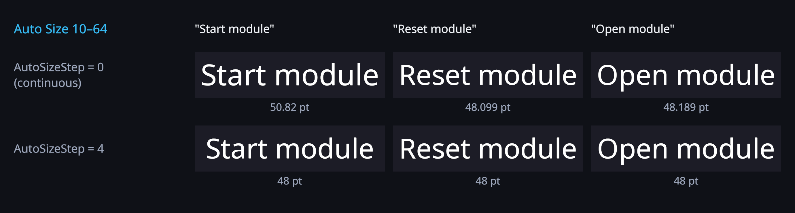

# Auto Size fit steps

With **Auto Size** on, OpenGlyph picks the largest font size between **Min Size** and **Max Size** at
which the text fits the rect. By default any size can come out (26.8125 pt, 13.37 pt), so labels of
similar length end up at slightly different sizes. **Fit Step** (`AutoSizeStep`) restricts the result
to multiples of a step.



```csharp
label.AutoSize = true;
label.MinFontSize = 10;
label.MaxFontSize = 48;
label.AutoSizeStep = 1f;    // whole points: 26 rather than 26.8125
label.AutoSizeStep = 0.5f;  // half points
label.AutoSizeStep = 0f;    // continuous (default, previous behaviour)
```

## Rules

- The result is the **largest multiple of the step that fits** (binary search over the multiples, so
  the result is exact, not just rounded down from the continuous search).
- **Max Size** is used as is when the text fits at it, even if it is not a multiple of the step.
- **Min Size** is used when no multiple fits (or there is no multiple between Min and Max).
- Without word wrap the width-limited size is rounded down to the step.
- Changing the step re-lays out the text when Auto Size is on. Negative values are treated as 0.

## Tests

`Tests/Editor/Wave1AutoSizeStepTests.cs`:

- `AutoSizeStep_PicksTheLargestFittingMultiple`: a one-sentence text in a 420 × 110 rect: continuous
  26.8125 pt, step 1 → 26 pt (fits; 27 pt does not), step 0.5 → 26.5 pt (fits; 27 pt does not), step 0 →
  26.8125 pt again.
- `AutoSizeStep_NoWrap_FloorsTheWidthLimitedSize`: single-line text, step 2 → the continuous size rounded
  down to a multiple of 2.
