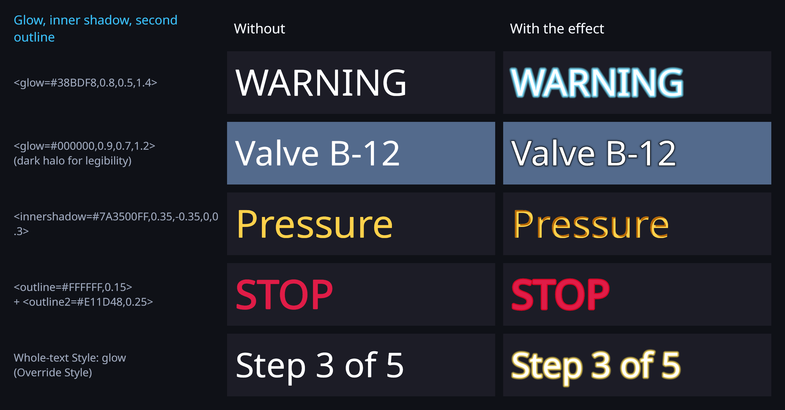

# Glow, inner shadow and second outline

Three more layers for the SDF/MSDF text style, next to face, outline and underlay (drop shadow):

- **Glow**: a soft halo around the glyphs. A bright glow highlights; a dark glow keeps text legible
  over busy 3D backgrounds.
- **Inner shadow**: a shadow inside the face, offset like the underlay.
- **Second outline** (`outline2`): another stroke band outside the outline (e.g. a white outline with a
  red rim).



## Span tags

Register `SpanStyleModifier` with kind `Glow`, `InnerShadow` or `Outline2` and the matching
`GlowParseRule`, `InnerShadowParseRule`, `Outline2ParseRule` (Inspector group *Tags* / *Appearance*):

```csharp
using LightSide;

text.RegisterModifier(new ModRegister { Modifier = new SpanStyleModifier(SpanStyleModifier.Kind.Glow), Rule = new GlowParseRule() });
text.RegisterModifier(new ModRegister { Modifier = new SpanStyleModifier(SpanStyleModifier.Kind.InnerShadow), Rule = new InnerShadowParseRule() });
text.RegisterModifier(new ModRegister { Modifier = new SpanStyleModifier(SpanStyleModifier.Kind.Outline2), Rule = new Outline2ParseRule() });
text.Text = "<glow=#38BDF8,0.8,0.5,1.4>WARNING</glow> <outline=#FFFFFF,0.15><outline2=#E11D48,0.25>STOP</outline2></outline>";
```

| Tag | Parameters | Meaning |
|---|---|---|
| `<glow=#RRGGBBAA,size,softness,intensity>` | size 0..1 (0.5), softness 0..1 (0.5), intensity (1) | size is a fraction of the atlas spread (the SDF padding); softness 0 = hard plateau, 1 = fast soft falloff; intensity multiplies the alpha |
| `<innershadow=#RRGGBBAA,x,y,dilate,softness>` | as `<underlay>` | the face minus a shifted copy of the glyph; offsets in underlay units (try ±0.1 … ±0.5) |
| `<outline2=#RRGGBBAA,width,softness>` | width 0..1 (0.1), softness 0..1 (0) | band from the outline's outer edge outwards |

They nest with the other span styles (`<outline>`, `<underlay>`, `<dilate>`, `<softness>`, `<style>`);
the inner tag wins per field.

## Whole text

On the component style (`UniText.OverrideStyle = true`, `UniText.Style`):

```csharp
var style = UniTextStyle.Default;
style.glowColor = new Color(0.98f, 0.75f, 0.14f, 1.2f); // alpha > 1 = more intense
style.glowOuter = 0.7f;      // size
style.glowPower = 1.8f;      // falloff exponent (1 = linear, larger = softer)
style.glowOffset = 0f;       // shifts where the glow starts
style.innerShadowColor = new Color(0, 0, 0, 0.7f);
style.innerShadowOffsetX = 0.2f; style.innerShadowOffsetY = -0.2f;
style.outline2Color = Color.black; style.outline2Width = 0.2f;
text.Style = style;
text.OverrideStyle = true;
```

A legacy material with `GLOW_ON` or `UNDERLAY_INNER` maps to the same fields through the appearance
shim, so a migrated appearance keeps its glow and inner shadow in the unified renderer.

## Renderers

| | Unified (`UniText/Uber`) | Legacy desktop (`UniText/SDF`, `MSDF` …) | Legacy mobile (`UniText/Mobile/SDF`, `Mobile/MSDF`) |
|---|---|---|---|
| Glow | span + whole text | material `GLOW_ON` (existing, additive) | material `GLOW_ON` (new; same model as unified) |
| Inner shadow | span + whole text | material `UNDERLAY_INNER` | material `UNDERLAY_INNER` |
| Second outline | span + whole text | — | — |

Span styles render only with the unified renderer (the legacy renderer draws one material per font and
logs a warning once per component).

## Cost

All three use the distance field the glyph already samples, so they need no extra geometry and no extra
pass. In `UniText/Uber` their parameters are read from the style table once per vertex; a glyph without
them pays only a branch. Glow and second outline add a few arithmetic instructions per pixel; inner
shadow adds one atlas sample per pixel of the glyphs that use it. All shaders keep the single-pass
instanced stereo macros (`ShaderStereoLintTests`).

## Limitations

- The glow cannot reach further than the atlas spread (SDF padding): `size = 1` is the whole padding.
  Fonts with a small padding get a smaller maximum glow.
- In the unified renderer the glow is composited behind the text with its own colour (not tinted by
  vertex colour or gradients); the desktop legacy shaders keep their additive glow.
- Second outline is unified-only.

## Tests

`Tests/Editor/Wave2EffectTests.cs`: `Markup_ParsesGlowInnerShadowOutline2`,
`SpanOverride_NestsAndComposes_NewLayers`, `StyleTable_PacksNewColumns`,
`Shim_MapsInnerUnderlayKeywordToInnerShadow`, and GPU renders into a RenderTexture:
`Uber_SpanGlow_DrawsAHaloAroundTheGlyphs`, `Uber_WholeTextStyleGlow_FromComponentStyle`,
`Uber_InnerShadow_DarkensInsideTheFace`, `Uber_SecondOutline_DrawsABandOutsideTheOutline`,
`LegacyMobileSdf_GlowKeyword_RendersGlow`.
