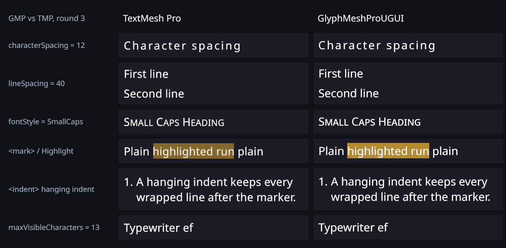
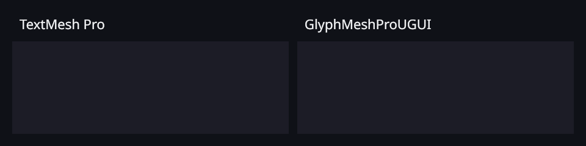

# GlyphMeshPro vs TextMeshPro Parity

**Status: Round 3.** Phase A (stored-only properties now real) and Phase B (small caps, highlight, layout tags, Page/Linked overflow) are wired; see the Round 3 section at the end for semantics and test names. This document maps TextMeshPro's API and rich-text
tag surface onto OpenGlyph's `GlyphMeshProUGUI` (Canvas) and `GlyphMeshPro` (world-space).
Every row is kept in sync with ACTUAL behaviour; a non-"applied" status is a real gap.

### Round 2 status summary

| Feature | Status | Evidence |
|---------|--------|----------|
| fontStyle Underline / Strikethrough | **done** | evidence/fontstyle_underline_strike.png |
| fontStyle UpperCase / LowerCase (+ `<uppercase>`/`<lowercase>`) | **done** | evidence/fontstyle_upper_lower.png |
| fontStyle Superscript / Subscript (+ ``/``) | **done** | evidence/markup_sup_sub.png |
| Justified / Flush alignment | **done** | evidence/alignment_justified_flush.png |
| Tag `<voffset>` | **done** | evidence/markup_voffset.png |
| fontStyle Highlight (`<mark>`) | **done (R3)** | `MarkTag_DrawsLineHighBoxBehindRun` (legacy + unified) |
| fontStyle SmallCaps | **done (R3)** | `SmallCaps_UsesSmcpOrSyntheticCapitalsAtPointEight` |
| Tags `<nobr>  <align> <indent> <line-indent> <mark> <noparse>` | **done (R3)** | see tag table; `<sprite>` out of scope |
| 3D GlyphMeshPro (world-space MeshRenderer) | **not started** (Round-1 stub) | headless host + mesh emission |
| Overflow Page / Linked / ScrollRect | **done (R3)** | see overflow table |

Each "done" row: deterministic headless test + full suite BOTH modes (renderer-off 256 pass/0 fail; unified-on 272 pass/0 fail; 280 total) + GPU side-by-side PNG verified against real TextMeshPro.

tag surface of Unity's TextMeshPro (`TMP_Text` / `TextMeshProUGUI`) onto the
OpenGlyph components `GlyphMeshProUGUI` (Canvas, implemented in Round 1) and
`GlyphMeshPro` (world-space `MeshRenderer`, design + stub in Round 1).

## Legal / clean-room note

TextMeshPro is distributed under the **Unity Companion License**; OpenGlyph is
**MIT**. Nothing in GlyphMeshPro copies or ports TMP source, shaders, or assets.
The parity surface below is derived by **reflecting TMP's public API names, enum
members, and documented tag syntax**, and by **observing TMP's rendered behavior
in tests**. All implementation is written independently against OpenGlyph's own
engine (`LightSide.UniText` shaping/layout/renderer). TMP member *names* are
reproduced only so that migration is a mechanical rename; the semantics are
re-implemented, not transcribed.

## Architecture decision: subclass `UniText` (composition rejected)

`GlyphMeshProUGUI : LightSide.UniText` — it **inherits** the existing engine
component rather than composing a reference to one. Rationale:

- **No second engine (hard requirement).** `UniText : MaskableGraphic` owns the
  `CanvasRenderer`, the `TextProcessor`, the `UniTextMeshGenerator`, the unified
  renderer path, and the dirty-flag rebuild loop. The engine is *inseparable*
  from its `MaskableGraphic` host — it cannot be driven as a plain field without
  a second `MaskableGraphic` on the GameObject (which **is** a second renderer).
  Subclassing reuses exactly one engine instance and one `CanvasRenderer`.
- **Renderer-on and renderer-off come free.** `UniText.UseUnifiedRenderer` and
  the `UnifiedRenderer` (`UseProjectSetting`/`ForceOn`/`ForceOff`) property are
  inherited unchanged, so GlyphMeshProUGUI works in both modes with no extra code.
- **`ILayoutElement` / `ILayoutController` come free.** `UniText` already
  implements both (`UniText_Layout.cs`); `preferredWidth`/`preferredHeight` and
  auto-size are inherited. Composition would force a re-implementation or a
  manual forward of every layout member.
- **Engine state is private but fully exposed via public properties** (`Text`,
  `FontSize`, `WordWrap`, `HorizontalAlignment`, `VerticalAlignment`,
  `AutoSize`, `MinFontSize`/`MaxFontSize`, `color`, `SetDirty(DirtyFlags)`, …).
  The TMP-named adapter forwards to these public members only — it does **not**
  touch private fields — so it is robust to engine refactors.

The adapter adds **no** serialized state of its own that duplicates the engine;
TMP-named properties are thin façades over the inherited `UniText` properties.
Where TMP exposes a concept the engine lacks (overflow modes, justification,
`textInfo`), the adapter adds the minimum new state and a documented behavior.

### Type mappings (for migration)

| TextMeshPro type              | OpenGlyph / GlyphMeshPro type         | Notes |
|-------------------------------|---------------------------------------|-------|
| `TextMeshProUGUI`             | `OpenGlyph.GlyphMeshProUGUI`          | Canvas component. |
| `TextMeshPro`                 | `OpenGlyph.GlyphMeshPro`              | World-space; design + stub (Round 1). |
| `TMP_FontAsset`               | `LightSide.UniTextFont`               | Font asset. |
| `TMP_Text`                    | `GlyphMeshProUGUI` base surface       | Abstract base in TMP; folded into the component here. |
| `FontStyles` (flags)          | `OpenGlyph.FontStyles` (flags)        | Mirror of TMP flag names. Every flag applies (SmallCaps and Highlight since R3). |
| `TextAlignmentOptions`        | `OpenGlyph.TextAlignmentOptions`      | Mirror of TMP names; see Alignment section for gaps. |
| `TextOverflowModes`           | `OpenGlyph.TextOverflowModes`         | Mirror of TMP names; every mode is live (ScrollRect/Page/Linked since R3). |
| `TextWrappingModes`           | `OpenGlyph.TextWrappingModes`         | Mapped onto engine `WordWrap` bool. |
| `VertexGradient`              | `OpenGlyph.VertexGradient`            | 4-corner color struct mirroring TMP. |
| `TMP_TextInfo`                | `OpenGlyph.GlyphTextInfo`             | characterCount/lineCount/wordCount/pageCount/characterInfo (incl. isVisible)/lineInfo subset. |
| `TMP_CharacterInfo`           | `OpenGlyph.GlyphCharacterInfo`        | Subset of fields. |
| `TMP_LineInfo`                | `OpenGlyph.GlyphLineInfo`             | Subset of fields. |

Status legend: **direct** = inherited/forwarded 1:1 · **adapter** = re-expressed
over the engine with matching semantics · **new** = engine feature added for
parity · **stub** = present with TMP signature, TODO body (documented) ·
**oos** = out of scope for Round 1 (reason given).

## Core API parity (`TMP_Text` / `TextMeshProUGUI` → `GlyphMeshProUGUI`)

| TMP member | Status | Mapping / notes |
|------------|--------|-----------------|
| `string text` | direct | → `UniText.Text`. |
| `SetText(string)` | adapter | → `Text` (no re-parse flag needed). |
| `SetText(string, bool syncTextInputBox)` | adapter | sync flag ignored (no input field in R1). |
| `SetText(char[])`, `SetText(char[],start,length)` | direct | → `UniText.SetText(char[],…)`. |
| `SetText(StringBuilder)` | adapter | copies into pooled char buffer, no per-call string alloc. |
| `SetText(string, float arg0 … arg7)` | new | **No-alloc** numeric formatting into a reused `char[]`; mirrors TMP's `{0}`–`{7}` placeholder overloads. |
| `TMP_FontAsset font` | adapter | → `UniText.FontStack`/`MainFont` via `UniTextFont`. |
| `float fontSize` | direct | → `UniText.FontSize`. |
| `bool enableAutoSizing` | direct | → `UniText.AutoSize`. |
| `float fontSizeMin` / `fontSizeMax` | direct | → `UniText.MinFontSize` / `MaxFontSize`. |
| `FontStyles fontStyle` | adapter | Bold->FontWeight, Italic->StyleAxis. Underline, Strikethrough, UpperCase, LowerCase, SmallCaps, Superscript, Subscript and Highlight are composed as engine span tags (auto-registered modifiers). SmallCaps and Highlight since R3. |
| `Color color` | direct | → `UniText.color` (override). |
| `bool enableVertexGradient` + `VertexGradient colorGradient` | **wired (R3)** | Per character quad: BL/TL/TR/BR corner colours multiplied with the vertex colour (after `<color>`), as TMP. Test `VertexGradient_FourCorners_MultipliedWithColor` (legacy + unified). `TMP_ColorGradient` presets are not supported. |
| `TextAlignmentOptions alignment` | adapter | split into `HorizontalAlignment`+`VerticalAlignment`; Justified/Flush/Geometry/Baseline/Capline/Midline gaps documented below. |
| `TextWrappingModes textWrappingMode` | adapter | NoWrap→`WordWrap=false`; Normal→`WordWrap=true`; PreserveWhitespace(NoWrap) stubbed to Normal/NoWrap + TODO. |
| `bool enableWordWrapping` (obsolete) | adapter | legacy bool → `WordWrap`. |
| `TextOverflowModes overflowMode` | adapter/new | All modes. ScrollRect = Overflow (as TMP, no warning); Page and Linked since R3 (see overflow table). |
| `float characterSpacing` | **wired (R3)** | em/100 of the font size after every character (after the cluster's last glyph); preferred width counts n-1 spacings like TMP. Test `CharacterSpacing_AddsEmHundredthsAfterEachCharacter_LikeTmp`. |
| `float wordSpacing` | **wired (R3)** | em/100 after each whitespace (and U+200B). Test `WordSpacing_AddsEmHundredthsAfterWhitespace_LikeTmp`. |
| `float lineSpacing` | **wired (R3)** | em/100 added to every line advance; negative values overlap lines (no clamp), as TMP. Test `LineSpacing_AddsEmHundredthsBetweenLines_IncludingNegative_LikeTmp`. |
| `float paragraphSpacing` | **wired (R3)** | em/100 added after a line ending in U+000A/U+2029 only (not after soft wraps). Test `ParagraphSpacing_AddsOnlyAfterParagraphBreaks_LikeTmp`. |
| `Vector4 margin` | **wired (R3)** | Insets the layout and mesh rect (L,T,R,B; negative grows it); positive margins are added to the preferred size, as TMP. The Masking clip still uses the full rect. Test `Margin_InsetsTextArea_AndAddsToPreferredSize_LikeTmp`. |
| `bool richText` | **wired (R3)** | false: the run is wrapped in a literal span (`NoParseParseRule`), so tags show verbatim; `fontStyle` still applies. Test `RichTextOff_ShowsTagsLiterally`. |
| `int maxVisibleCharacters` | **wired (R3)** | Hidden characters emit no geometry; a change only regenerates the mesh (no reshape, no relayout — checked by counters), so typewriter animation is cheap. `textInfo.characterInfo[i].isVisible` follows. Test `MaxVisibleCharacters_HidesGlyphs_TypewriterDoesNotReshapeOrRelayout`. |
| `int maxVisibleWords` | **wired (R3)** | TMP word rules (letters/digits/hyphens; counted after the visibility test). Test `MaxVisibleWords_And_MaxVisibleLines_HideLikeTmp`. |
| `int maxVisibleLines` | **wired (R3)** | Line index from the engine's lines. Same test. |
| `bool isRightToLeftText` | adapter | → `UniText.BaseDirection = RightToLeft`. |
| `float preferredWidth` / `preferredHeight` | direct | inherited `ILayoutElement`. |
| `GetPreferredValues()` + 3 overloads | adapter | → `TextProcessor.GetPreferredWidth/Height`. |
| `GetRenderedValues()` / `(bool)` | adapter | → engine `ResultSize`. |
| `ForceMeshUpdate(bool,bool)` | adapter | → `UniText.SetDirty(DirtyFlags.Text)` (full rebuild) + synchronous layout flush. |
| `TMP_TextInfo textInfo` | adapter | `GlyphTextInfo`: characterCount, lineCount, wordCount, pageCount, characterInfo[] (isVisible honours maxVisible*), lineInfo[] from engine `ResultGlyphs`/lines. |
| `bool raycastTarget` | direct | inherited from `Graphic`. |
| `TMP_TextInfo GetTextInfo(string)` | stub | returns populated `GlyphTextInfo` for the given text; TODO full fidelity. |
| `uint[] Text` (parsed), `TextRenderFlags`, `TextureMappingOptions`, `MaskingTypes`, `FontWeight` enum, sprite/link DBs | oos | advanced/renderer-internal surface not required by R1 scope. |

## Alignment parity (`TextAlignmentOptions`)

TMP alignment = `HorizontalAlignmentOptions` (`Left/Center/Right/Justified/Flush/Geometry`)
× `VerticalAlignmentOptions` (`Top/Middle/Bottom/Baseline/Geometry/Capline`).
OpenGlyph engine supports `HorizontalAlignment {Left,Center,Right}` ×
`VerticalAlignment {Top,Middle,Bottom}`.

| TMP alignment family | Status | Mapping |
|----------------------|--------|---------|
| `TopLeft/Top/TopRight` | direct | H∈{L,C,R}, V=Top. |
| `Left/Center/Right` | direct | H∈{L,C,R}, V=Middle. |
| `BottomLeft/Bottom/BottomRight` | direct | H∈{L,C,R}, V=Bottom. |
| `*Justified` | **applied (R2)** | The layout pass distributes inter-word slack so every line but the paragraph's last fills the box; last line stays ragged. Verified by test + GPU PNG vs TMP. |
| `*Flush` | **applied (R2)** | Like Justified but the paragraph's last line is justified too. Verified by test + GPU PNG. |
| `*GeoAligned` / H=`Geometry` | oos | Geometry-based alignment (align to rendered glyph bounds) — niche; mapped to Center + documented. |
| `Baseline*` (V=Baseline) | adapter | mapped to `UnderEdge=Baseline` + V=Bottom approximation. |
| `Capline*` (V=Capline) | adapter | mapped to `OverEdge=CapHeight` + V=Top approximation. |
| `Midline*` (V=Geometry) | adapter | mapped to V=Middle. |

**Physical vs logical Left/Right (B23).** TMP's Left/Right are physical: `TopLeft` hugs the rect's
left edge even for an Arabic/Hebrew paragraph. The core engine's `HorizontalAlignment.Left/Right`
are paragraph-relative start/end edges (an RTL paragraph with Left is flush right — the plain
`UniText` behaviour, unchanged). `GlyphMeshProUGUI` overrides `UsePhysicalAlignment => true`, which
sets `LayoutSettings.physicalAlignment` (carried in `TextProcessSettings.PhysicalAlignment`); the
layout pass then swaps Left/Right for each RTL paragraph, so GlyphMeshPro matches TMP. Center,
Justified and Flush are unaffected. Tests: `HorizontalAlignmentSemanticsTests`.

**Round 2 (verified):** Justified/Flush are now really justified � the engine layout pass
distributes inter-word slack. Justified fills every line but the paragraph's last (last line
ragged, matching TMP); Flush justifies the last line too. GPU evidence:
`scratch/gmp-round2/evidence/alignment_justified_flush.png` (lines fill the column, match TMP).

## Font-style parity (`FontStyles` flags)

| TMP flag | Status | Mapping |
|----------|--------|---------|
| `Normal` | direct | default. |
| `Bold` | adapter | engine `FontWeight` → 700 (synthetic bold fallback if no bold face). **Wired.** |
| `Italic` | adapter | engine `FontStyleAxis = Italic` (synthetic oblique fallback). **Wired.** |
| `Underline` | **applied (R2)** | `fontStyle` composes `<u>…</u>` around the run; the component auto-registers `UnderlineParseRule`+`UnderlineModifier`. Verified by test + GPU evidence PNG (line present, matches TMP). |
| `Strikethrough` | **applied (R2)** | `fontStyle` composes `<s>…</s>`; auto-registers `StrikethroughParseRule`+`StrikethroughModifier`. Verified by test + GPU evidence PNG. |
| `UpperCase` | **applied (R2)** | composes `<uppercase>` (alias of engine `upper`) + `UppercaseModifier`. Verified by test + GPU PNG. | `LowerCase` | **applied (R2)** | composes `<lowercase>` + new `LowercaseModifier`. Verified. | `SmallCaps` | **applied (R3)** | composes `<smallcaps>`: the font's OpenType `smcp` when it has it, else synthetic (lowercase -> capital at 0.8x, TMP). Test `SmallCaps_UsesSmcpOrSyntheticCapitalsAtPointEight`. |
| `Subscript` / `Superscript` | **applied (R2)** | compose ``/`` + new `SuperSubscriptModifier` (0.5 scale on advance + quad, baseline raise/lower). Verified by test + GPU PNG vs TMP. |
| `Highlight` | **applied (R3)** | composes `<mark>` (TMP default #FFFF0040). Test `MarkTag_DrawsLineHighBoxBehindRun`. |

**Current reality (verified by test + GPU evidence):** `fontStyle` applies **Bold, Italic, Underline, Strikethrough, UpperCase, LowerCase, Superscript and Subscript**. U/S compose `<u>`/`<s>`; case composes `<uppercase>`/`<lowercase>` (pre-shape codepoint transform); sup/sub compose ``/`` (scale + baseline shift). GPU PNGs: fontstyle_underline_strike.png, fontstyle_upper_lower.png, markup_sup_sub.png (all match TMP). SmallCaps/Highlight still need engine modifiers (tracked below).
Underline and Strikethrough**. Underline/Strikethrough render by composing the engine's
`<u>`/`<s>` span tags around the run; the GPU evidence PNG
(`scratch/gmp-round2/evidence/fontstyle_underline_strike.png`) shows both lines present and
matching TMP. The remaining flags (Upper/LowerCase, SmallCaps, Sub/Superscript, Highlight) are
stored and round-trip so bitmasks migrate from TMP unchanged, but have no visible effect yet —
they need engine modifiers that do not exist (tracked below). Use markup where the engine already
has a rule.

## Overflow parity (`TextOverflowModes`)

| TMP mode | Status | Behavior in R1 |
|----------|--------|----------------|
| `Overflow` | direct | engine default — content overflows the rect. |
| `Ellipsis` | adapter | truncate at last fitting break and append `…`. |
| `Truncate` | adapter | hard clip at last fully-fitting glyph, no marker. |
| `Masking` | adapter | rely on inherited `MaskableGraphic` clip rect (`SetClipRect`). |
| `ScrollRect` | **wired (R3)** | Overflow, no warning (TMP does the same). Test `OverflowScrollRect_BehavesAsOverflow_WithoutWarning`. |
| `Page` | **wired (R3)** | Lines are grouped into pages that fit the text area; `pageToDisplay` (1-based, clamped) selects the page, laid out from the top. `textInfo.pageCount`. Test `OverflowPage_ShowsTheRequestedPageOfLines_LikeTmp`. |
| `Linked` | **wired (R3)** | Keeps the lines that fit (Truncate); `linkedTextComponent` (a GlyphMeshProUGUI) gets the same text with `firstVisibleCharacter` = first overflowing character, and so on down the chain (same frame); no overflow clears the linked text, as TMP. Test `OverflowLinked_SendsOverflowingTextToLinkedComponent_LikeTmp`. |

## Wrapping parity (`TextWrappingModes`)

| TMP mode | Status | Mapping |
|----------|--------|---------|
| `NoWrap` | direct | `WordWrap=false`. |
| `Normal` | direct | `WordWrap=true`. |
| `PreserveWhitespace` | stub | TODO — maps to Normal; whitespace-preservation flag not yet wired. |
| `PreserveWhitespaceNoWrap` | stub | TODO — maps to NoWrap. |

**Observed behaviour (verified by test):** an over-long single token (no break
opportunities) wider than the rect is **character-wrapped** across lines by the
engine's emergency overflow break — matching TMP's character-wrapping fallback
for an unbreakable word. It stays on one line only when it fits the width.

## Rich-text tag parity

**Verified** against the engine's registered parse rules (`Runtime/ModCore/Rules/*`,
each rule's `TagName`). The engine's actual tag set is: `b, i, u, s, size, color,
cspace, line-height, line-spacing, gradient, link, style, upper, outline, underlay,
dilate, softness, ellipsis, obj`. TMP tags are mapped against that reality — several
common TMP tags have **no engine rule in Round 1** and are listed as gaps, not glossed
as supported.

| TMP tag | Status | Mapping / notes |
|---------|--------|-----------------|
| `<b>` | direct | engine `BoldParseRule` (`b`). |
| `<i>` | direct | engine `ItalicParseRule` (`i`). |
| `<u>` | direct | engine `UnderlineParseRule` (`u`). |
| `<s>` | direct | engine `StrikethroughParseRule` (`s`). |
| `<size=…>` | direct | engine `SizeParseRule` (`size`). |
| `<color=…>` / `<#rrggbb>` | direct | engine `ColorParseRule` (`color`). |
| `<cspace=…>` | direct | engine `CSpaceParseRule` (`cspace`). |
| `<line-height=…>` | direct | engine `LineHeightParseRule` (`line-height`). |
| `<gradient=…>` | direct | engine `GradientParseRule` (`gradient`) + `UniTextGradients`. |
| `<link=…>` | direct | engine `LinkTagParseRule` (`link`). |
| `<style=…>` | direct | engine span-style rule (`style`). |
| `<uppercase>` | **applied (R2)** | `UppercaseAliasParseRule` (name alias of engine `upper`) + `UppercaseModifier`. |
| `<lowercase>` | **applied (R2)** | new `LowercaseParseRule` + `LowercaseModifier`. |
| `<smallcaps>` | **applied (R3)** | `SmallCapsParseRule` + `SmallCapsModifier` (smcp or synthetic). |
| `<mark>` / `<mark=#RRGGBBAA>` | **applied (R3)** | `MarkParseRule` + `MarkModifier`: one solid box per line, run advances wide, font ascender..descender tall, drawn behind the glyphs; alpha = min(tag, component). `padding`/`color=` attributes not parsed. |
| `` / `` | **applied (R2)** | new `SuperscriptParseRule`/`SubscriptParseRule` + `SuperSubscriptModifier`. Verified by GPU PNG vs TMP. |
| `<voffset=�>` | **applied (R2)** | new `VOffsetParseRule` + `VOffsetModifier` (per-span vertical shift of the glyph quad; em/px/% value). Verified by GPU PNG vs TMP. |
| `<nobr>` | **applied (R3)** | `NoBreakParseRule` + `NoBreakModifier` (removes soft break opportunities inside the span). Test `NoBrTag_KeepsSpanOnOneLine`. |
| `<mspace=…>` | **gap (R2)** | no engine monospace rule; TODO. |
| `<space=…>` | **gap (R2)** | no engine rule; TODO. |
| `<width=…>` | **gap (R2)** | no engine rule; TODO. |
| `<indent=N|N%|Nem>` / `<line-indent=…>` | **applied (R3)** | `IndentParseRule`/`LineIndentParseRule` + `IndentModifier`. indent: the pen jumps to the indent where the tag opens and every following line of the span starts there; line-indent: first line of each paragraph in the span. Tests `IndentTag_IndentsWrappedLines_AndJumpsMidLine_LikeTmp`, `LineIndentTag_IndentsFirstLineOfEachParagraph`. |
| `<margin=…>` | **gap (R2)** | no engine inline-margin rule; component-level `margin` property only. |
| `<align=left|center|right|justified|flush>` | **applied (R3)** | `AlignParseRule` + `AlignModifier`: per-line override (first codepoint of the line carrying one). Test `AlignTag_SetsPerParagraphAlignment`. |
| `<alpha=#xx>` | **gap (R2)** | no engine rule; TODO (fold into `color`). |
| `<font="Name">` | **applied (R3)** | `FontParseRule` + `FontModifier`; name lookup in `UniTextFontRegistry` (see Round 3). Characters the font lacks fall back to the stack. Test `FontTag_SwitchesFontForSpan_ResolvedByName`. |
| `<pos>` / `<rotate>` / `<sprite>` / `<page>` | oos | positional/sprite/page tags — not in R1 scope. |

**OpenGlyph-only tags (no TMP equivalent, present in the engine):** `line-spacing`,
`outline`, `underlay`, `dilate`, `softness` (SDF style controls), `ellipsis`, `obj`.
These are additive and do not affect TMP migration.

## `GlyphMeshPro` (world-space `MeshRenderer`) — design (Round 1 = design + stub)

Target: Quest / world-space text without a Canvas. Design:

- `GlyphMeshPro : MonoBehaviour` requiring `MeshRenderer` + `MeshFilter`
  (not a `Graphic`), reusing the **same** `TextProcessor`/shaping/layout engine
  via a thin headless engine host (no `CanvasRenderer`).
- Shares the TMP-named adapter surface with `GlyphMeshProUGUI` through a common
  `IGlyphMeshText` interface so property code is written once.
- Mesh pushed to `MeshFilter.sharedMesh`; material = OpenGlyph SDF material
  (unified renderer shader), enabling world-space SDF with the same quality.
- Round 1 ships the component **stub** (serialized fields + `IGlyphMeshText`
  surface, `// TODO R2` bodies) + this design. Full headless engine host and
  mesh emission are Round 2.

## Open gaps (tracked)

- Wrapping **PreserveWhitespace / PreserveWhitespaceNoWrap**.
- `GlyphMeshPro` headless engine host + world-space mesh emission (separate task).
- `<sprite>` (separate task), `<pos>` / `<rotate>` / `<page>` tags.
- `GetTextInfo(string)` full fidelity (sprite/link/word info arrays).
- Rich-text tags with no engine rule: `<mspace>`, `<space>`, `<width>`, `<margin>` (inline), `<alpha>`.
- `<mark>` `padding=` / `color=` attributes; `` `material=` attribute (ignored).
- `TMP_ColorGradient` presets (`colorGradientPreset`).
- Wrapping counts a trailing space against the width (TMP does not), so a line can wrap one word earlier than TMP.
- A canonically composable base + mark (e.g. `z` + U+0301) is shaped by HarfBuzz as ONE precomposed
  glyph (`ź`), which TMP draws as two characters; that glyph appears with its first character.
- With a `maxVisible*` limit, TMP's Middle/Bottom vertical alignment follows the visible lines; GMP
  aligns the whole laid-out text.
- Mid-line `<line-indent>` (only the line-start case is applied) and an `<indent>` jump followed by
  a wrap that breaks BEFORE the jump on the same line (rare; the wrap width is then approximate).

## Round 2.1 — grey-text fix + justification line-break parity (PR #17 review follow-up)

Two defects were found in the GPU side-by-side review images and fixed:

### 1. Grey / heavier text (all GlyphMeshPro text, size-dependent)
GlyphMeshPro rendered **grey, heavier, soft-edged** where TextMeshPro is crisp white.
Measured from the pixels: at small font sizes (~30 pt) the glyph interior never
saturated (peak luminance 244/255, 0 % near-white) and the ink spread ~65 % wider.
A large glyph saturated fine — the bug was size-dependent, which is why no existing
test caught it (the unified-vs-legacy pixel tests compare two OpenGlyph paths, not vs
TMP).

**Root cause:** the `UniText/Uber` shader derived the SDF coverage-ramp slope in the
**fragment** from `ddx/ddy(uv0.y) * _AtlasSize * 0.75`. That approximation
under-estimates the true screen pixel size at small sizes, so the ramp went shallow.

**Fix:** compute `baseScale` in the **vertex** shader exactly as the legacy
`UniText/SDF-Face` does — `rsqrt(dot(pixelSize, pixelSize)) * (_Sharpness+1)` with
`pixelSize` from the clip-space `w` and `UNITY_MATRIX_P * _ScreenParams` (TMP's
own method) — and carry it to the fragment (`cov.z`) for face, outline and underlay.
This matches the legacy path the pixel-equivalence suite already validates, so those
tests stay green. Guarded by `WhiteText_Face_ReachesNearWhite_LikeTMP` (30 pt white
text must peak >= 98 % luminance; was 95.7 %, now 100 %).

### 2. Justified / Flush line breaks now match TMP
TMP keeps a near-fitting word on a justified line by allowing the line to overrun the
box by up to **5 %** before wrapping, then compressing inter-word spacing to pull it
back (in the review paragraph "quickly" stays on line 2 in TMP but moved to line 3 in
ours). Mirrored exactly:

- `LineBreaker` takes a `widthTolerance` (1.05 for Justified/Flush, 1.0 otherwise)
  so plain Left/Center/Right wrapping is byte-identical; only Justified/Flush pack more.
- `TextProcessor` captures the alignment and the live component re-breaks when the
  alignment crosses the justify boundary (so a runtime Left->Justified switch re-wraps).
- `TextLayout` justification distributes **negative** slack too (compress an overrun
  line back into the box), not only positive (spread).

Guarded by `Alignment_Justified_KeepsNearFittingWord_OnLine_NotWrapped` (deterministic)
and `Compare_Justified_LineCount_MatchesTMP` (vs real TMP: 5 = 5 lines at the review
width). Plain UniText layout is unchanged — the tolerance only engages for Justified/Flush.

### Justified spacing split (word + character), Flush letter-spread
Justification distributes the line's slack exactly as TMP's `wordWrappingRatios`
(default 0.4): **word spacing absorbs 60 %** (spread across the whitespace gaps) and
**character spacing absorbs 40 %** (spread across every visible glyph). This applies to
both spread (positive slack) and compress (negative slack, from a 5 %-tolerance
overrun line), so a packed line compresses word AND letter spacing together instead of
collapsing the word gaps to zero. A hard floor additionally caps space compression at
30 % (a space keeps >= 70 % of its natural width); any remainder is left as residual
overflow within the 5 % tolerance. Because the character-spacing share applies to every
justified/flush line, **Flush now spreads the last line's letters** ("t o  v e x  t h e
 g y m n a s t.") matching TMP. Measured on the review paragraph's justified line 2, the
narrowest word gap is GMP 4 px vs TMP 5 px (80 %). Full `charWidthAdjDelta` glyph-width
scaling (TMP shrinks glyph bodies as a last resort) is still not implemented, so an
extreme overrun could leave a hair of residual overflow rather than squeezing glyphs —
not observed in the review cases.

### Shader-change scope (grey fix)
The grey fix changed `UniText/Uber`'s SDF `scale`, which is the shared unified render
path for ALL text, not only GlyphMeshPro. It replaces a fragment `ddx/ddy` approximation
with the legacy `UniText/SDF-Face` **vertex** formula **verbatim**, so unified now matches
the legacy production AA by construction. `UnifiedRendererPixelEquivalenceTests`
(sdf / msdf / colored-span) report `maxDelta=0`, `0.000 %` pixels differing — unified
geometry/UVs still byte-match legacy. Brightness is near-white at both small (30 pt) and
large (120 pt) sizes; outline / underlay / MSDF / SDF tests all pass.

### Scope: opt-in, GlyphMeshPro only
The 5% wrap tolerance and the word+character justification split are gated behind
`LayoutSettings.tmpJustification` (carried in `TextProcessSettings`). Only the
TMP-parity components set it (`GlyphMeshProUGUI` overrides `UseTmpJustification =>
true`); plain `UniText` leaves it `false` and keeps the exact pre-Round-2.1
Justified/Flush layout — tolerance 1.0, slack on inter-word whitespace only, no
character spacing. `TextProcessor` captures the flag at the first pass and the live
component passes it to `EnsureLines`; `CanReuseLines` re-breaks when it flips.
Guarded by `PlainUniText_Justified_And_Flush_KeepLegacyWordGapOnly_Layout` (plain
line breaks == Left, and no character advance inserted between visible glyphs).

### Grapheme-cluster safety
The character-spacing share is applied once per GRAPHEME CLUSTER — after the last glyph
of each cluster (`CountJustifyTargets` counts distinct non-whitespace cluster ids, not
glyphs) — so a base and its marks / conjunct parts are never pushed apart. On a line
containing a cursive JOINING script (Arabic, Syriac, N'Ko, Mongolian, Arabic
Presentation Forms, Mandaic) character spreading is skipped entirely and the whole slack
goes to the inter-word spaces (with the 70% floor); RTL lines never justify on this path
(base-direction guard). Guarded by `Gmp_Justified_Thai_KeepsEveryMarkOffsetRelativeToItsBase`
and `Gmp_Justified_Khmer_KeepsEveryMarkOffsetRelativeToItsBase` — every multi-glyph
cluster's intra-cluster glyph offsets are identical justified vs unjustified. (Devanagari
is not a bundled fixture; Thai vowel/tone marks and Khmer subscript conjuncts exercise the
same multi-glyph-cluster property.)

## Round 3 — stored-only properties made real + missing TMP features

Rendered offscreen in the Editor with the same Noto Sans font, size (32 pt / 28 pt) and rect for both
components. The one intended difference: GlyphMeshPro draws the highlight behind the text (TMP draws it
over).

All Round 3 tests live in `Tests/Editor/GlyphMeshProParity3Tests.cs`. Where a real
`TextMeshProUGUI` can be built in the test host (the tests give TMP a runtime settings instance and a
stand-in shader when the TMP Essential Resources are absent; layout does not depend on the shader),
the same text/size/rect is measured in TMP and compared; the measured numbers are logged with a
`[GMP3]` prefix.

### Units and semantics
- **characterSpacing / wordSpacing / lineSpacing / paragraphSpacing** use TMP units: em/100 of the
  font size (`fontSize * 0.01 * value`). They are inputs on `TextProcessor`
  (`CharacterSpacingEm`, `WordSpacingEm`, `LineSpacingEm`, `ParagraphSpacingEm`) that plain
  `UniText` leaves at 0; `GlyphMeshProUGUI` pushes them in `ConfigureTextProcessor` before every
  rebuild. Character/word spacing is added after shaping and after the `Shaped` modifiers (so `<size>`
  does not scale it), once per character after its cluster's last glyph. Line/paragraph spacing is added
  to each line advance after the minimum-advance clamp, so negative values overlap lines as in TMP.
- **margin** comes from `UniText.LayoutMargins` (virtual, zero for `UniText`): the layout rect and
  the mesh origin are inset; positive margins are added to the preferred size (TMP's rendered size).
- **richText = false** wraps the raw run in `<og-raw>…</og-raw>`, matched by a `NoParseParseRule`
  that closes at the LAST closing tag, so no other rule sees the text. `<noparse>` (TMP) is
  registered too.
- **Vertex gradient**: a per-glyph colour pass subscribed last, so it multiplies the final vertex
  colour (`<color>` included): BL/TL/TR/BR = corner × colour. Colour (emoji) fonts are skipped.
- **TMP character counting** (fixed after the first demo render): TMP counts every character in
  `textInfo.characterInfo` — spaces, newlines and combining marks — and draws each separately because its
  default font features are kerning only (no `liga`/`clig`). GlyphMeshPro therefore shapes
  Latin/Greek/Cyrillic/Common runs with `liga`/`clig` off (`TextProcessor.DisableLatinLigatures`; complex
  scripts and `rlig` untouched), maps every glyph of a cluster to its own codepoint (a base and its marks
  are revealed one by one), reports whitespace/control characters as `isVisible = false`, and lets a
  breaking space at a line end hang instead of forcing a wrap (`LineBreaker` `hangTrailingSpaces`), as
  TMP does. Tests: `MaxVisibleCharacters_CountsSpacesNewlinesAndMarks_LikeTmp`,
  `MaxVisibleWords_CountsLikeTmp`, `MaxVisibleLines_CountsLikeTmp` (every limit value over spaces,
  newline, `ffi`/`ff`/`fl` ligature text and combining marks: 0 mismatches vs a real TextMeshProUGUI),
  `TrailingSpace_DoesNotForceWrap_LikeTmp` (45 widths, same line starts as TMP).
- **maxVisibleCharacters / Words / Lines**: TMP's visibility rule (`i < maxChars && words < maxWords
  && line < maxLines`) is evaluated into a per-codepoint mask handed to the mesh generator
  (`UniTextMeshGenerator.ClusterHidden`); hidden glyphs emit no quad, and underline/strike/mark skip
  them. The setters dirty only the mesh (`DirtyFlags.Color`): the test animates every value and
  asserts `TextProcessor.FirstPassCount` and `LayoutCount` do not move.
- **SmallCaps**: `Shaper.FontSubstitutesFeature(font, 'smcp')` probes the font once (shapes a
  lowercase sample with and without the feature). With `smcp`, the span is shaped with a ranged
  HarfBuzz feature; otherwise lowercase letters become capitals drawn and advanced at 0.8×.
  Noto Sans has `smcp`, so the bundled fixture exercises the real-feature path.
- **Highlight / `<mark>`**: solid quads that sample the inside of the underscore glyph (opaque in
  every SDF/MSDF shader); their triangles are moved to the front of the segment so the box is drawn
  behind the glyphs, in both the legacy and the unified renderer. (TMP draws its highlight over the
  text, which is why its default colour is translucent; boxes behind the text were requested here.)
- **`<font="Name">`** lookup (`UniTextFontRegistry`): 1) fonts registered with
  `UniTextFontRegistry.Register(name, font)` (or `Register(stack)`, by stack asset name); 2) fonts of the
  component's font stack, its fallback stacks and family faces, by asset name; 3) the project default
  font stack. Case-insensitive. `default` or an unknown name leaves the span on the component font.
  Names are snapshotted on the main thread (worker threads never read `Object.name`); call
  `UniTextFontRegistry.InvalidateNames()` after renaming fonts at runtime.
- **Page**: `TextProcessor.PageToDisplay` groups lines greedily into pages that fit the layout height
  and lays out only the requested page from the top; `PageCount` and `FirstOverflowCodepoint` are
  reported. Vertical alignment uses the page's height.
- **Linked**: the source truncates; after its mesh is applied it sets the linked component's text and
  `firstVisibleCharacter` (= `TextProcessor.FirstOverflowCodepoint`). Lines start at
  `FirstVisibleCodepoint` in `LineBreaker`. Components dirtied while meshes are being applied are now
  processed in a follow-up pass of the same frame (bounded to 8 passes), so a chain updates at once.

### Registration
`GlyphMeshProUGUI` auto-registers every new rule/modifier pair. For plain `UniText` they are ordinary
`ModRegister` options (`NoParseParseRule`+`EmptyModifier`, `NoBreakParseRule`+`NoBreakModifier`,
`AlignParseRule`+`AlignModifier`, `IndentParseRule`/`LineIndentParseRule`+`IndentModifier`,
`FontParseRule`+`FontModifier`, `SmallCapsParseRule`+`SmallCapsModifier`, `MarkParseRule`+`MarkModifier`).