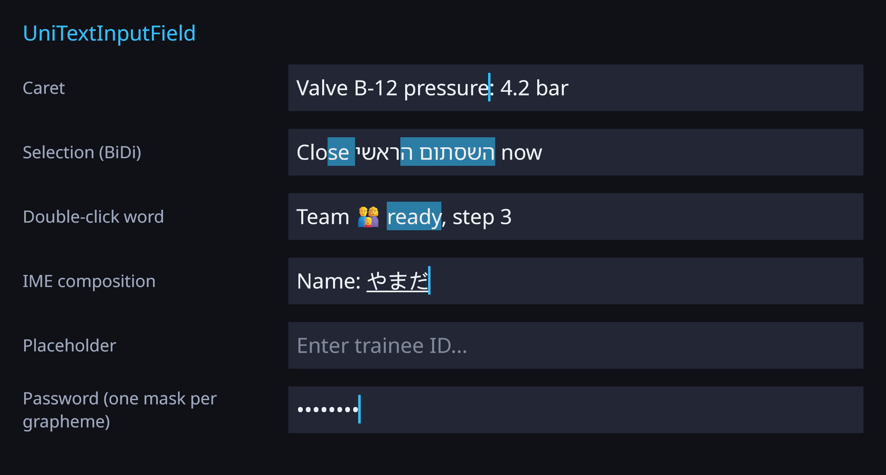
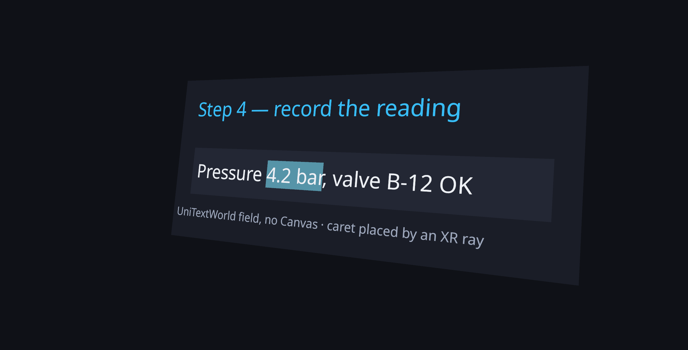
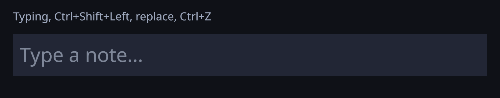
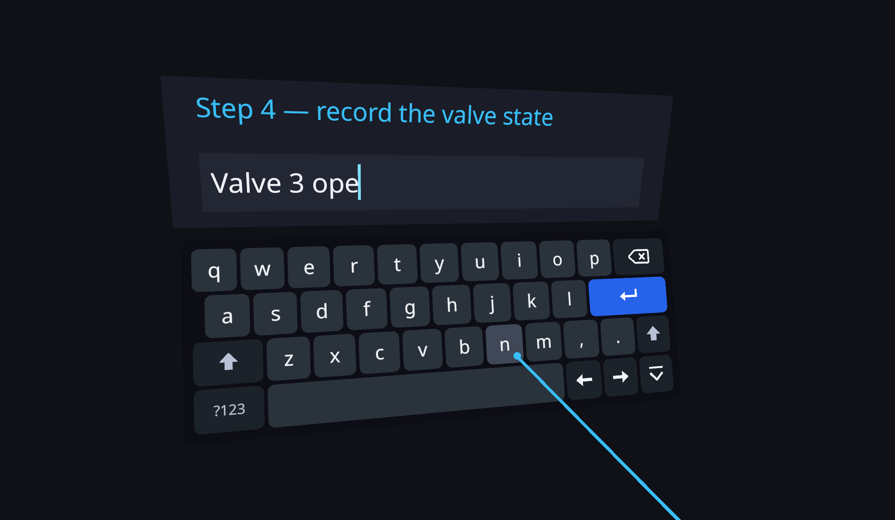

# Input field: editable text for Canvas, world space and VR

`UniTextInputField` is an editable text field built on the OpenGlyph engine. It edits a `UniText`
on a Canvas, or a `UniTextWorld` in world space with no Canvas. `GlyphMeshProInputField` is the same field
with the `TMP_InputField` API. `UniTextSelectableText` makes any label selectable and copyable without
making it editable.

Because the caret and selection work on the engine's own layout, the field handles everything the engine
renders:

- **Grapheme clusters.** The caret moves, and Backspace/Delete remove, whole grapheme clusters. It never
  stops inside an emoji ZWJ sequence, a flag, a combining mark or a surrogate pair.
- **BiDi visual caret.** Arrow keys move the caret the way the arrow points through mixed Hebrew, Arabic
  and Latin text. At a direction boundary one logical position has two places on the line, so the caret
  keeps an affinity.
- **Words.** Word movement and word deletion follow the UAX #29 word rules.
- **Markup is not interpreted by default.** Tags the user types stay literal text. Turn on `RichText` to
  render them; the caret then moves over the visible characters only.









## Quick start

### Canvas

```csharp
var field = UniTextInputField.Create(canvas.transform, world: false, size: new Vector2(320, 48),
    placeholderText: "Your name");
field.TextComponent.FontStack = fonts;          // and the placeholder: ((UniText)field.Placeholder).FontStack
field.ContentType = InputFieldContentType.Name;
field.CharacterLimit = 32;
field.onSubmit.AddListener(name => Debug.Log("Hello " + name));
```

You can also use **GameObject > UI > OpenGlyph > UniText - Input Field**, or **GlyphMeshPro - Input Field**
for the TMP API. The menu adds an EventSystem if there is none: with `InputSystemUIInputModule` when the
Input System is active, otherwise with `StandaloneInputModule`.

### World space and VR

```csharp
var field = UniTextInputField.Create(panel, world: true, size: new Vector2(400, 60));
field.transform.localScale = Vector3.one * 0.001f;   // 400 units = 40 cm
field.TextComponent.FontStack = fonts;
```

You can also use **GameObject > 3D Object > OpenGlyph > UniText Input Field (World)**.

A world field draws its text with `UniTextWorld`, and its caret and selection with small MeshRenderers. It
keeps a `BoxCollider` sized to the field, so pointer events reach it through:

- a `PhysicsRaycaster` on the camera, or
- XRI's `TrackedDevicePhysicsRaycaster` with an `XRUIInputModule`.

The field uses the raycast hit point, so a controller ray places the caret, double-click selects a word,
and dragging selects. For a custom pointer that does not use the EventSystem, call one of these:

```csharp
field.SetCaretFromRay(controllerRay);               // or SetCaretFromWorldPoint(hit.point)
field.SetCaretFromRay(controllerRay, extendSelection: true);   // drag
```

## On-screen keyboard (phones, tablets, VR)

`SoftKeyboard` picks the keyboard that opens when the field gets focus:

| `SoftKeyboard` | Opens |
|---|---|
| `Auto` (default) | The system keyboard (`TouchScreenKeyboard`) where it works: phones and tablets. The built-in [`UniTextKeyboard`](VRKeyboard.md) when an XR device is active (`XRSettings.isDeviceActive`): Meta Quest under OpenXR, PC VR. Nothing on desktop. |
| `System` | Always `TouchKeyboard` (default `SystemTouchKeyboard`, a `TouchScreenKeyboard` wrapper). |
| `BuiltIn` | Always the built-in keyboard (`BuiltInKeyboard`, or an enabled one in the scene, or one created on demand). |
| `None` | No on-screen keyboard. `HideSoftKeyboard = true` has the same effect. |

`ResolvedSoftKeyboard` tells which one `Auto` picks right now. `OpenBuiltInKeyboard` is the built-in
keyboard that is open for the field, if any.

**Meta Quest.** Under OpenXR, `TouchScreenKeyboard.Open` returns a keyboard whose `visible` is true, but
nothing appears on the headset. This happens even with `oculus.software.overlay_keyboard` in the Android
manifest. So in XR, `Auto` treats the default `SystemTouchKeyboard` as unusable and opens the built-in
keyboard. The Meta system keyboard overlay needs the **Meta XR SDK's Virtual Keyboard** (Meta XR Core SDK,
`OVRVirtualKeyboard`), which OpenGlyph does not include or depend on. To use it anyway:

1. Wrap it in an `IInputFieldTouchKeyboard`.
2. Assign that wrapper to `TouchKeyboard`.

`Auto` trusts any custom implementation whose `IsSupported` is true, also in XR.

**System keyboard flow.** On phones the field mirrors the system keyboard's text and selection. **Done**
submits, **Cancel** restores the text, and closing the keyboard ends editing.

**Built-in keyboard flow.** It opens below the field (or where its `Placement` says), with the numeric pad
for Integer / Decimal / PIN and the e-mail row for e-mail fields. Its keys type through `ProcessText` and
`ProcessKey`. Pressing a key does not take focus from the field: the keyboard is an
`IInputFieldFocusKeeper`. Submit, deselect and the Hide key all close it. Password fields get no key
preview popup. See [VRKeyboard.md](VRKeyboard.md).

**Your own keyboard.** Call `ProcessText`, `ProcessKey(InputFieldKey.Backspace)` and the other input
methods from your keys. Then set `SoftKeyboard = None`, and `KeyboardSource = null` if a physical keyboard
should not type. To keep the field focused when your keyboard is clicked, implement
`IInputFieldFocusKeeper` on it.

## Hierarchy

```
Input Field     UniTextInputField (+ background Image on a Canvas, BoxCollider in world space)
└ Text Area     viewport: the text scrolls inside it (RectMask2D on a Canvas)
  ├ Placeholder UniText / UniTextWorld (any Graphic)
  └ Text        UniText / UniTextWorld / GlyphMeshProUGUI / GlyphMeshPro
```

At runtime the field creates a **Selection** object (drawn behind the text) and a **Caret** object (drawn in
front) next to the Text. They are not saved with the scene. On a Canvas they are `MaskableGraphic`s, so
the viewport's RectMask2D clips them. In world space the field clips the text in object space to the
viewport (unified renderer), and clips the caret and selection on the CPU.

The field sets two options on its text component:

- `WordWrap`: off for single-line fields, which scroll sideways; on for multi-line fields.
- `Overflow`: always `Overflow`. The field scrolls and clips itself, so it does not truncate.

## Properties

| Property | Meaning |
|---|---|
| `Text`, `SetTextWithoutNotify` | The plain text. Setting it applies validation, the line type and the character limit. |
| `CaretPosition`, `SelectionAnchorPosition`, `SelectionFocusPosition`, `SetSelection(a, b)`, `SelectedText` | UTF-16 indices. They are always on grapheme boundaries; values inside a cluster snap to its start. |
| `ContentType`, `LineType`, `InputType`, `KeyboardType`, `CharacterValidation` | See [content types](#content-types). Changing a dependent option sets `ContentType` to `Custom`, as in uGUI and TMP. |
| `CharacterLimit` | Maximum length in UTF-16 units (0 = no limit). Cuts happen at grapheme boundaries, so a half emoji is never inserted. |
| `MaxPasteLength` | Pasted text is cut to this length (default 16384). |
| `AsteriskChar` | The mask character. Passwords show one per grapheme. |
| `ReadOnly` | Allows selection, navigation and copy; hides the caret; blocks all edits. |
| `RichText` | Off (default): the text is shown literally. On: the text component parses markup, and the caret skips the tags. |
| `CaretBlinkRate`, `CaretWidth`, `CaretShape` (Bar / Block / Underline), `CaretColor` / `CustomCaretColor`, `CustomCaret` | Caret look. A blink rate of 0 gives a steady caret. `CustomCaret` moves your own object (a sprite, a 3D cursor) to the caret instead of drawing one. |
| `SelectionColor` | Selection highlight colour. |
| `OnFocusSelectAll`, `ResetOnDeActivation`, `RestoreOriginalTextOnEscape`, `TabNavigation` | Focus behaviour. Tab / Shift+Tab move focus to the next or previous `Selectable`. |
| `HideMobileInput`, `HideSoftKeyboard` | Touch keyboard options. `HideSoftKeyboard` disables every on-screen keyboard. |
| `SoftKeyboard`, `BuiltInKeyboard`, `ResolvedSoftKeyboard`, `OpenBuiltInKeyboard` | Which on-screen keyboard opens on focus. See [on-screen keyboard](#on-screen-keyboard-phones-tablets-vr). |
| `UndoGroupTimeout` | Keystrokes closer together than this (seconds) undo as one step. |
| `KeyboardSource`, `TouchKeyboard`, `Clipboard` | Replaceable input backends. See [input backends](#input-backends). |
| `IsFocused`, `DisplayedText`, `CaretLocalRect`, `GetSelectionRects`, `ScrollOffset` | Read-only state, for custom visuals and tests. |

**Methods:**

- `ActivateInputField`, `DeactivateInputField`.
- `SelectAll`, `Copy`, `Cut`, `Paste`, `Undo`, `Redo`.
- `MoveTextStart`, `MoveTextEnd`, `MoveToStartOfLine`, `MoveToEndOfLine`.
- `ForceLabelUpdate`.
- `ProcessKey`, `ProcessText`, `ProcessChar`, `SetComposition`.

## Events

Each event is a UnityEvent, and most have a C# event as well:

| UnityEvent | C# event | When |
|---|---|---|
| `onValueChanged` | `ValueChanged` | The text changed: an edit, or a `Text` assignment. |
| `onEndEdit` | `EndEdit` | Editing ended. |
| `onSubmit` | `Submitted` | Enter in a single-line or `MultiLineSubmit` field, or **Done** on the touch keyboard. |
| `onSelect` | `Selected` | The EventSystem selected the field. |
| `onDeselect` | `Deselected` | The EventSystem deselected the field. |
| `onTextSelection(text, start, end)` | `SelectionChanged` | The selection changed. The C# event also fires when the selection is cleared. |
| `onEndTextSelection` | — | The selection was cleared. |
| `onValidateInput` (delegate) | — | A filter for each character: `(text, index, ch) => ch`, or `'\0'` to reject the character. |

## Keys

| Key | Action |
|---|---|
| ← → | Move one grapheme in visual order. Shift extends the selection. Without Shift, a selection collapses to its left or right edge. |
| Ctrl/Alt + ← → | Move one word (the start of the next or previous word). In a right-to-left line the direction is mirrored. |
| ↑ ↓, PageUp/PageDown | Move by line, keeping the column. In a single-line field they go to the start or end. |
| Home / End | Start or end of the visual line. With Ctrl: start or end of the text. |
| Backspace / Delete | Delete one grapheme. With Ctrl: delete one word. |
| Enter | Submit, or a newline in `MultiLineNewline` fields. |
| Esc | Cancel: restore the text from when editing started, and end editing. |
| Ctrl+A / C / X / V | Select all, copy, cut, paste. |
| Ctrl+Z, Ctrl+Y / Ctrl+Shift+Z | Undo, redo. |
| Shift+Del, Ctrl+Ins, Shift+Ins | Cut, copy, paste. |
| Tab | Move focus to the next field (`TabNavigation`). |

On macOS, Command works as Control.

Pointer actions:

- A click places the caret on the nearer edge of the grapheme you clicked.
- Shift+click extends the selection.
- A double-click selects a word; a triple-click selects the visual line.
- Dragging selects, and auto-scrolls the field.

**Undo:**

- Typing coalesces into one undo step per word. A space after a letter starts a new step, and so does a
  pause longer than `UndoGroupTimeout`.
- Each run of Backspaces or Deletes is one step.
- Moving the caret, paste, cut, word delete and replacing a selection each end the current step.

**Paste:**

- Line endings are normalised to `\n`.
- Control characters (C0, DEL, C1) are removed.
- Newlines are kept only in multi-line fields.
- The pasted text is cut to `MaxPasteLength` and the character limit, then validated one character at a
  time.

## Content types

These follow the uGUI / TMP semantics:

| Content type | Line | Input | Touch keyboard | Validation |
|---|---|---|---|---|
| Standard | any | Standard | Default | — |
| Autocorrected | any | AutoCorrect | Default | — |
| IntegerNumber | single | Standard | NumberPad | Digits, and a minus sign only at the start. |
| DecimalNumber | single | Standard | DecimalPad | Integer rules plus one `.` or `,`. |
| Alphanumeric | single | Standard | ASCIICapable | `A-Z a-z 0-9` |
| Name | single | Standard | Default | Letters, single spaces, one apostrophe; each word is capitalised. |
| EmailAddress | single | Standard | EmailAddress | Letters, digits, one `@`, no `..`, and ``!#$%&'*+-/=?^_`{|}~`` |
| Password | single | Password | Default, secure | — |
| Pin | single | Password | NumberPad, secure | Digits |
| Custom | — | set yourself | set yourself | set yourself |

Password and PIN fields show one `AsteriskChar` per grapheme. The text component never receives the real
text, and the field never copies a password to the clipboard. `Text` returns the real value.

## IME composition

- The IME's uncommitted text appears at the caret with an underline. It is not part of `Text`, and it
  hides the placeholder.
- An open composition replaces the selection.
- While a composition is open, the field ignores keys; the IME owns them.
- The commit arrives as typed text.
- An empty composition with no text cancels.
- The candidate window is placed at the caret: `Input.compositionCursorPos` on the legacy backend,
  `Keyboard.SetIMECursorPosition` on the Input System.
- Password fields turn the IME off.

## Input backends

The source is chosen at compile time from the project's **Active Input Handling**:

| Project setting | Keyboard source |
|---|---|
| Input System package installed and enabled (also with "Both") | `InputSystemKeyboardSource`: `Keyboard.current.onTextInput`, `onIMECompositionChange`, key states. |
| Legacy Input Manager only | `LegacyKeyboardSource`: `Input.inputString`, `Input.compositionString`, `Input.GetKey`. |

`OPENGLYPH_INPUTSYSTEM` is an asmdef version define on `com.unity.inputsystem`. Held arrows, Backspace and
Delete repeat after `InputFieldKeyboardSources.RepeatDelay` (0.5 s), at `RepeatRate` (30 per second).

Set `KeyboardSource` to your own `IInputFieldKeyboardSource` to feed a field from any device.
`SimulatedTouchKeyboard` runs the touch keyboard flow (open, sync, Done / Cancel) in the Editor, and
`InputFieldMemoryClipboard` replaces the system clipboard. The tests use both.

## Selectable text and the TMP-shaped field

**`UniTextSelectableText`.** Add it next to any `UniText` to allow selection (click, drag, double/triple
click, Shift+arrows) and Ctrl+C. It works over the label's visible text, so markup is never copied or
changed. No caret is drawn, and the label's wrapping and overflow settings are not touched.

**`OpenGlyph.GlyphMeshProInputField`.** The `TMP_InputField` member names, forwarded to
`UniTextInputField`:

- Text and positions: `text`, `caretPosition`, `stringPosition`, `selectionAnchorPosition` and the other
  selection positions.
- Configuration: `characterLimit`, `contentType`, `lineType`, `inputType`, `keyboardType`,
  `characterValidation`, `readOnly`, `richText`, `placeholder`, `textComponent`, `textViewport`,
  `pointSize`, and the caret and selection colours.
- Events: `onValueChanged`, `onEndEdit`, `onSubmit`, and the rest.
- Methods: `ActivateInputField`, `DeactivateInputField`, `MoveTextEnd/Start`, `MoveToEnd/StartOfLine`,
  `ForceLabelUpdate`, `ProcessEvent(Event)`.

The nested enums mirror TMP's (`GlyphMeshProInputField.ContentType.Pin`, ...). Create one with
`GlyphMeshProInputField.CreateGlyphMeshPro(parent)`. A test drives it and a real `TMP_InputField` with the
same 15 key events and compares text, caret and anchor after each one. The remaining gaps are listed in
[GlyphMeshPro-Parity.md](GlyphMeshPro-Parity.md#input-field-glyphmeshproinputfield--wave-4).

## Cost

- **Idle.** A focused, idle field allocates nothing per frame. The caret blink toggles the
  `CanvasRenderer` alpha (Canvas) or `MeshRenderer.enabled` (world), with no rebuild.
- **Edits.** An edit relays out the text component once, the same as setting `Text`. The caret map is
  rebuilt from the new layout in the component's `LayoutApplied` callback.
- **Touch keyboard.** While the system keyboard is open, the field reads `TouchScreenKeyboard.text` every
  frame. On Android that read allocates a string. The built-in keyboard keeps no copy of the text, so it
  allocates nothing per frame.

## Limitations

- **Words in some scripts.** Thai, Lao, Khmer and Myanmar text has no dictionary word segmentation for
  word movement and double-click: a run without spaces is one word. Line breaking does use the dictionary.
- **Regex validation.** TMP's `Regex` character validation and `TMP_InputValidator` assets are not
  supported. Use `onValidateInput`.
- **Missing TMP extras.** There is no scrollbar binding, no `lineLimit`, and no input field font asset
  property. Set fonts on the text component.
- **Rich text editing.** With `RichText` on, the text is the markup source. The caret maps visible
  characters back to the source by alignment, which assumes the markup only removes characters (tags).
  Tags that replace text (for example `<upper>`) give approximate caret positions.
- **World clipping.** World-space text is clipped to the viewport only by the unified renderer. With the
  legacy renderer, text that scrolls past the field is not clipped (the caret and selection still are).
- **Device checks.** On-device touch keyboard behaviour (Android/iOS), the built-in keyboard in a headset,
  and XR ray input are exercised only through the test seams in the Editor. Verify them on device.
- **Meta system keyboard.** It is not supported through `TouchScreenKeyboard` under OpenXR (see
  [on-screen keyboard](#on-screen-keyboard-phones-tablets-vr)). It needs the Meta XR SDK's Virtual Keyboard
  behind a custom `IInputFieldTouchKeyboard`.

## Tests

| File | What it checks |
|---|---|
| `Tests/Editor/Wave4CaretTests.cs` | Grapheme stops (ZWJ family, flag, combining mark), whole-grapheme delete, the BiDi visual caret order in both directions with caret x monotonic, RTL paragraphs, UAX #29 word moves and word delete, Home/End, vertical moves with column memory (hard and soft lines), click / double / triple / drag, BiDi selection rects. |
| `Tests/Editor/Wave4EditingTests.cs` | Typing, Backspace/Delete, selection replace, surrogate pairs typed as two units; Enter per line type; undo/redo coalescing (word groups, backspace runs, timeout, redo cleared); paste sanitising, character limit at grapheme boundaries, `MaxPasteLength`, copy/cut; each content type; password mask glyphs; placeholder; IME composition insert / commit / cancel / replace selection; events and Escape; read-only; literal markup by default, `RichText` mapping. |
| `Tests/Editor/Wave4FieldTests.cs` | Horizontal and vertical scrolling keep the caret in the viewport; world field ray / XR-raycast caret placement at an angle; the touch keyboard flow (options per content type, validated sync, Done, Cancel, hidden); 0 GC allocations per idle focused frame (`GC.Alloc` recorder); GlyphMeshProInputField forwarding and the step-by-step comparison with a real `TMP_InputField`; `UniTextSelectableText`. |
| `Tests/Editor/Wave4BackendTests.cs` | The backend chosen for the project's input handling; the Input System source driven by a virtual keyboard (text, keys, Ctrl+A, IME events); Tab / Shift+Tab focus navigation. |
| `Tests/Editor/Wave5KeyboardTests.cs` | The built-in keyboard: `SoftKeyboard` Auto / System / BuiltIn / None with XR simulated; auto-show on focus and hide on submit / deselect / Hide; focus kept on key presses; layouts per content type. See [VRKeyboard.md](VRKeyboard.md#tests). |
