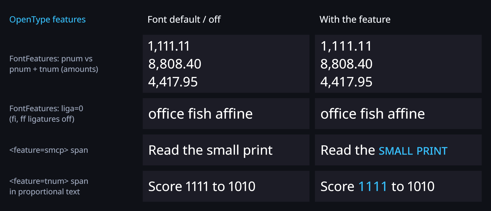

# OpenType features

OpenGlyph shapes text with HarfBuzz, so every OpenType feature a font has can be switched on or off:
tabular or old-style figures, small capitals, stylistic sets, character variants, ligatures, kerning.
Features are set for the whole component (`FontFeatures`) or for a span of text (`<feature=…>`).



## Component: `FontFeatures`

A list of feature settings applied to the whole text (Inspector: **Typography > Font Features**).

```csharp
using LightSide;

var price = GetComponent<UniText>();
price.FontFeatures = new[] { "tnum" };          // tabular figures: digits all the same width
price.FontFeatures = new[] { "onum", "pnum" };  // old-style, proportional figures
price.FontFeatures = new[] { "liga=0" };        // no standard ligatures (fi, fl, ff ...)
price.FontFeatures = new[] { "ss01", "cv05=2" };
price.FontFeatures = null;                      // back to the font's defaults
```

Setting the property reshapes the text on the next rebuild.

## Span tag: `<feature=…>`

Register the pair **`FeatureParseRule` + `FeatureModifier`** (Inspector: **Mod Registers**, group *Tags* /
*Text Style*), or in code:

```csharp
uniText.RegisterModifier(new ModRegister { Rule = new FeatureParseRule(), Modifier = new FeatureModifier() });
uniText.Text = "Total <feature=tnum,lnum>1,234.50</feature> · <feature=smcp>Small caps</feature> · <feature=liga=0>fish</feature>";
```

The parameter is a list of settings separated by commas (or semicolons or spaces). The features apply
to exactly the span's characters: they are passed to `hb_shape` with the span's cluster range.

## Setting syntax

| Setting | Meaning |
|---|---|
| `tnum`, `+tnum` | feature on (value 1) |
| `-kern`, `liga=0`, `liga=off`, `liga=false` | feature off |
| `aalt=2`, `cv01=3` | alternate number *n* (for features with several alternates) |
| `cv1` | tags shorter than 4 characters are padded with spaces, as in OpenType |

Tags are 1–4 ASCII letters, digits or spaces. Entries that do not parse are ignored.

Common tags: `kern` (kerning), `liga` / `clig` / `dlig` (ligatures), `tnum` / `pnum` (tabular /
proportional figures), `lnum` / `onum` (lining / old-style figures), `zero` (slashed zero), `frac`,
`sups` / `subs`, `smcp` / `c2sc` (small caps), `case`, `ss01`–`ss20` (stylistic sets), `cv01`–`cv99`
(character variants), `salt`, `swsh`, `calt`.

## Precedence

For the same tag, later settings win (HarfBuzz order):

1. features the engine sets itself (`<smallcaps>` uses `smcp`; GlyphMeshProUGUI turns `liga`/`clig` off for
   Latin, as TextMesh Pro does);
2. the component `FontFeatures`;
3. `<feature>` spans, outer before nested, so an inner span wins on its range.

So `FontFeatures = { "liga=0" }` with `<feature=liga>fish</feature>` ligates only the tagged word, and
`liga` in `FontFeatures` re-enables ligatures on a GlyphMeshProUGUI.

## Notes and limitations

- A feature only does something if the font has it. In the tests, Noto Sans (the default font) has
  `tnum`/`pnum`, `liga`, `smcp` and `locl`; check other features in your font (e.g. with a font
  inspector) before relying on them.
- Features change glyphs and advances, so they affect line breaking and preferred sizes like any other
  shaping change.
- Required features (`rlig`, Arabic joining forms, Indic reordering, mark positioning) are always applied
  by HarfBuzz for the script; turning them off is possible but breaks complex scripts.
- Works the same in the serial and the parallel (worker-thread) pipeline.

## Tests

`Tests/Editor/Wave1FeatureTests.cs`:

- `FontFeatures_Tnum_MakesDigitAdvancesEqual`: with `pnum` the digits 0–9 advance 15.9–21.2 px at 36 px;
  with `pnum, tnum` all advance 20.592 px.
- `FeatureTag_TnumSpan_AppliesToExactlyItsRange`: in `1111<feature=tnum>1111</feature>1111` only the four
  tagged digits get the tabular width.
- `FontFeatures_LigaOff_DisablesFiLigature_AndSpanOverridesComponent`: `fish` is 3 glyphs by default, 4 with
  `liga=0`; a span turns it off for one word, and a `<feature=liga>` span turns it back on inside a
  component with `liga=0`.
- `FontFeatures_SettingAfterRender_Reshapes`, `FeatureParser_ParsesTagsValuesAndSigns`,
  `FeaturesAndLanguage_ParallelPath_MatchesSerial`.
