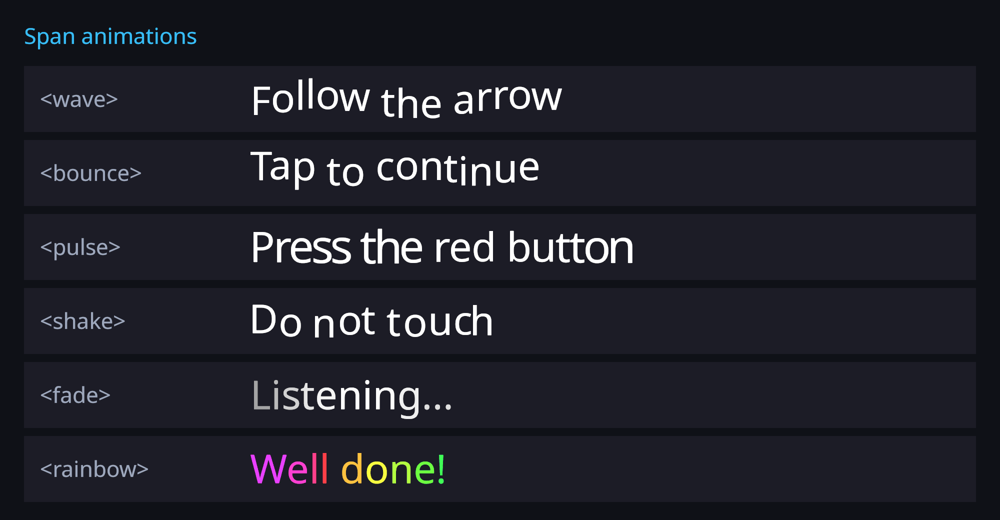

# Text animations

Span tags that animate glyphs over time: `<wave>`, `<bounce>`, `<pulse>`, `<shake>`, `<fade>` and
`<rainbow>`. Use them for attention cues in instructions ("press the **red** button") without
building extra objects.




## Usage

Register the tags (Inspector: **Mod Registers**, group *Animation*: a `WaveParseRule` with a
`TextAnimationModifier` of kind `Wave`, and so on), or all six at once in code:

```csharp
using LightSide;

var text = GetComponent<UniText>();
TextAnimationModifier.RegisterAll(text);
text.Text = "Press the <pulse><color=#ff4040>red</color></pulse> button, then <wave amp=6>follow the arrow</wave>.";
```

## Tags and parameters

Parameters are optional, as `key=value` pairs (`<wave amp=4 freq=2>`) or positional in the order below
(`<wave=4,2>`). Lengths are in mesh-local units (UI pixels at canvas scale); an omitted amplitude scales
with the font size. `phase` is the offset per character, counted from the start of the span in logical
order, so a letter and its combining marks move together.

| Tag | Parameters (default) | Effect |
|---|---|---|
| `<wave>` | `amp` (0.12 em), `freq` Hz (1.2), `phase` rad (0.6) | `y += amp·sin(2π·freq·t − phase·i)` |
| `<bounce>` | `amp` (0.2 em), `freq` hops/s (1.4), `phase` (0.45) | `y += amp·|sin(π·freq·t − phase·i)|` (always up) |
| `<pulse>` | `amp` scale fraction (0.15), `freq` (1.2), `phase` (0.4) | scale about the glyph centre by `1 + amp·(½ + ½ sin(…))` |
| `<shake>` | `amp` (0.05 em), `freq` jitters/s (18) | random offset in ±amp, new every 1/freq s (deterministic per glyph and step) |
| `<fade>` | `min` opacity (0.2), `freq` (0.8), `phase` (0.4) | alpha between `min` and 1 |
| `<rainbow>` | `freq` hue cycles/s (0.4), `phase` hue per character (0.06), `sat` (0.75) | replaces the colour's hue, keeps alpha |

`freq` also accepts the alias `speed`. Tags nest and combine (`<wave><rainbow>…</rainbow></wave>`).

## Clock

Each component integrates a shared clock:

| Property | Meaning |
|---|---|
| `UniText.AnimationTimeScale` | speed multiplier (default 1) |
| `UniText.AnimationUnscaledTime` | follow `Time.unscaledTime` (keeps animating while paused) |
| `UniText.AnimationPhase` | seconds added to the time, to de-synchronise identical labels |
| `UniText.ResetAnimationTime()` | restart the cycle |
| `UniTextAnimationClock.UseManualTime` / `ManualTime` | drive every component from your own time (tests, capture, sequencers) |

## How it works

Animation is a **vertex effect** (`IUniTextVertexEffect`), applied after mesh generation:

1. When a component with effects rebuilds (text, layout or colour change), its final meshes are
   copied once into its own buffers, with a table of glyph quads (cluster, quad centre).
2. Every frame (from `Canvas.willRenderCanvases`, after the frame's rebuilds) the captured positions and
   colours are copied into work buffers, the effects edit them, and only positions and colours are
   uploaded to the component's own mesh.

There is no per-frame shaping, layout or mesh generation, and no per-frame managed allocation. A
component without animated spans pays nothing (the hooks are not even subscribed). It works with the
unified and the legacy renderer, and with GlyphMeshProUGUI.

**Cost per frame**, per animated component: one array copy of its vertices and colours, a few
multiply-adds and one `sin` per animated glyph, and a vertex + colour upload of the component's mesh
(4 vertices per glyph). Measured in the Editor on Windows (`Wave2AnimationTests::Animation_CostPerGlyph`):
400 animated glyphs take 24.6 µs per frame including the mesh upload, about 62 ns per glyph (device numbers will be higher; no Quest measurement yet). Keep long paragraphs without animated spans in separate components so they are not re-uploaded.

You can write your own effect: implement `IUniTextVertexEffect` and call `uniText.AddVertexEffect(effect)`;
`UniTextVertexEffectContext` gives the glyph table and `Offset`, `Scale`, `MultiplyAlpha`, `SetRgb`,
`Vertex`, `Color` helpers.

## Limitations

- Underline, strikethrough and `<mark>` boxes are not animated (they stay in place).
- Effects move vertices only: glyphs never re-wrap, and the RectTransform does not grow with a bounce.
- `<rainbow>` replaces vertex RGB, so it overrides `<color>` and gradients on its span.

## Tests

`Tests/Editor/Wave2AnimationTests.cs` (unified and legacy): `Wave_AtQuarterPeriod_LiftsOnlyTheSpanByAmp`,
`Wave_PhasePerCharacter_ShiftsNeighbours`, `Bounce_IsAlwaysUpward`, `Pulse_ScalesAboutGlyphCentre`,
`Fade_ModulatesVertexAlpha`, `Rainbow_SetsHueKeepsAlpha`, `Shake_IsBoundedAndStepped`,
`Animation_NoReshapeRelayoutOrRebuild_PerFrame` (shaping, layout and mesh-upload counters unchanged over
30 frames, one vertex upload per frame), `Animation_AndReveal_ZeroGcPerFrame` (0 `GC.Alloc` samples over
60 frames, 27 animated glyphs plus a reveal), `NoAnimatedSpans_NoCaptureNoTick`,
`AnimationTimeScaleAndPhase_ChangeTheClock`.
