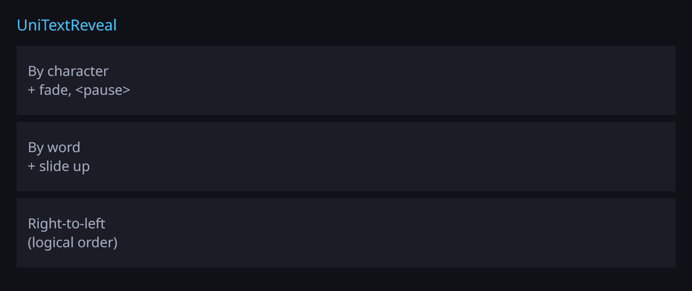
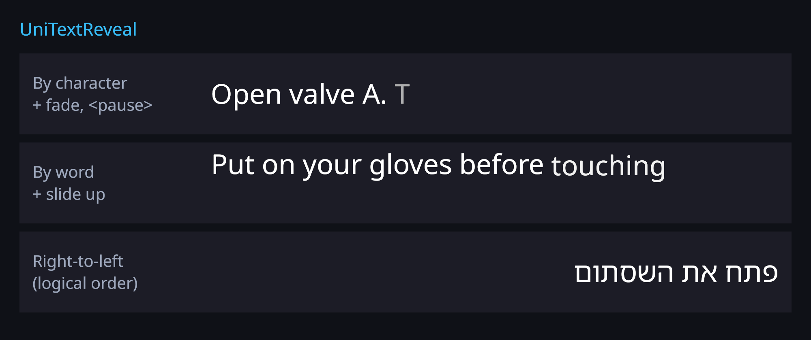

# Text reveal (typewriter)

`UniTextReveal` shows a text progressively: one grapheme cluster, word or line at a time, with a
speed, a start delay, a per-unit fade and slide, easing, events, and `<pause=seconds>` markers in the
text. It is made for step-by-step instructions (VR training, tutorials, dialogue).





## Usage

Add **UniText Reveal** (menu *UI/OpenGlyph/UniText Reveal*) to a GameObject with a `UniText` or
`GlyphMeshProUGUI`, or in code:

```csharp
using LightSide;

var text = GetComponent<UniText>();
UniTextReveal.RegisterPauseTag(text);              // optional: enables <pause=…>
text.Text = "Open valve A.<pause=0.6> Then wait for the green light.";

var reveal = text.gameObject.AddComponent<UniTextReveal>();
reveal.Unit = RevealUnit.Character;                // Character | Word | Line
reveal.UnitsPerSecond = 30f;
reveal.Delay = 0.3f;
reveal.FadeDuration = 0.1f;                        // 0 = each unit appears at once
reveal.SlideOffset = new Vector2(0f, -8f);         // each unit slides in from 8 units below
reveal.Easing = RevealEasing.EaseOut;
reveal.UnitRevealed += i => clickSound.Play();
reveal.RevealCompleted += () => nextButton.SetActive(true);
reveal.Restart();
```

## Properties

| Property | Default | Meaning |
|---|---|---|
| `Unit` | `Character` | `Character`: one grapheme cluster per step (a base letter with its marks, an emoji sequence; spaces count). `Word`: a run of non-whitespace; the following whitespace appears with it. `Line`: one laid-out line. |
| `UnitsPerSecond` | 30 | Steps per second. |
| `Delay` | 0 | Seconds before the first unit. |
| `FadeDuration` | 0.08 | Seconds each unit takes to fade in. |
| `SlideOffset` | (0, 0) | Offset, in mesh-local units, that a unit slides in from. |
| `Easing` | `EaseOut` | `Linear`, `EaseIn`, `EaseOut`, `EaseInOut`, `Smooth` (smoothstep); shapes fade and slide. |
| `PlayOnEnable` | true | Starts when the component is enabled in Play Mode. |
| `RestartOnTextChange` | true | A new text starts from the beginning. |
| `PreviewInEditor` | false | Also plays when enabled in Edit Mode (otherwise Edit Mode shows the full text until `Play`/`Restart` is called). |

State: `IsPlaying`, `IsComplete`, `PlaybackTime`, `UnitCount`, `RevealedUnitCount`, `Duration`,
`Visibility(unit)`.

## Control and events

- `Restart()` plays from the start; `Play()` resumes; `Pause()` stops advancing.
- `Skip()` jumps to the end. It raises `RevealCompleted` (and `RevealStarted` if it had not fired), but
  no `UnitRevealed` events, so skipping does not burst per-character sounds.
- `SetPlaybackTime(seconds)` scrubs without raising events.
- Events exist as C# events (`RevealStarted`, `UnitRevealed(int index)`, `RevealCompleted`) and as
  UnityEvents in the Inspector (`OnRevealStarted`, `OnUnitRevealed`, `OnRevealCompleted`).

## `<pause=seconds>`

Register `PauseParseRule` + `RevealPauseModifier` (or call `UniTextReveal.RegisterPauseTag`). The tag
adds no character (`CleanText` is unchanged) and holds the reveal for the given seconds before the unit
that follows it. A pause at the very end delays `RevealCompleted`. Several pauses add up.

## Time

The reveal advances with its component's animation clock: `UniText.AnimationTimeScale` and
`UniText.AnimationUnscaledTime` (keep revealing while `Time.timeScale` is 0). For deterministic
stepping (tests, video capture) set `UniTextAnimationClock.UseManualTime = true` and drive
`UniTextAnimationClock.ManualTime`; `UniText.TickVertexEffects()` runs the effects explicitly.

## How it works, and cost

The reveal is a vertex effect ([TextAnimations.md](TextAnimations.md#how-it-works)): it multiplies vertex
alpha and offsets vertex positions of the mesh the component already built. Revealing never
re-shapes, re-lays out or regenerates the text, and the per-frame pass allocates no managed memory
(`Wave2AnimationTests::Animation_AndReveal_ZeroGcPerFrame`: 0 `GC.Alloc` samples over 60 frames, both
renderers). While paused or complete it uploads nothing. Works with the unified and the legacy renderer.

## Right-to-left and bidirectional text

Units are taken in logical (reading) order, so Hebrew or Arabic reveals from the right, and in mixed
text an RTL run reveals right to left inside a left-to-right paragraph.

## GlyphMeshProUGUI `maxVisibleCharacters`

The two compose: `maxVisibleCharacters` / `maxVisibleWords` / `maxVisibleLines` remove characters from
the mesh, the reveal fades in what is left. Changing the cap keeps the reveal position.

## Limitations

- Underline, strikethrough and `<mark>` highlights appear with the last unit (they are not split per
  character).
- `Line` units follow the layout at capture time; resizing the rect re-captures and keeps the playback time.
- Character units count spaces and line breaks, so they also take time.

## Tests

`Tests/Editor/Wave2RevealTests.cs` (each on the unified and the legacy renderer where marked):
`ByCharacter_RevealsAtSpeed`, `FadeSlideAndDelay`, `Easing_ShapesTheFade`, `Events_PausePlaySkipRestart`,
`Rtl_RevealsInLogicalOrder`, `Bidi_MixedText_FollowsLogicalOrder`, `PauseTag_HoldsTheReveal`,
`ByWord_AndByLine`, `Graphemes_AreOneUnit`, `GlyphMeshPro_MaxVisibleCharacters_Composes`,
`TextChange_Restarts_AndRemovingTheComponentRestoresTheMesh`.
