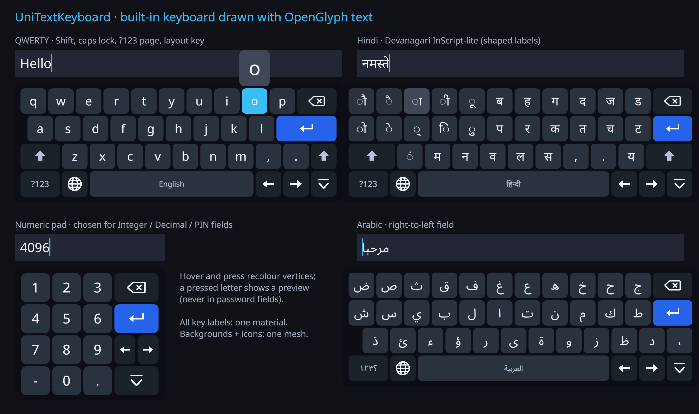
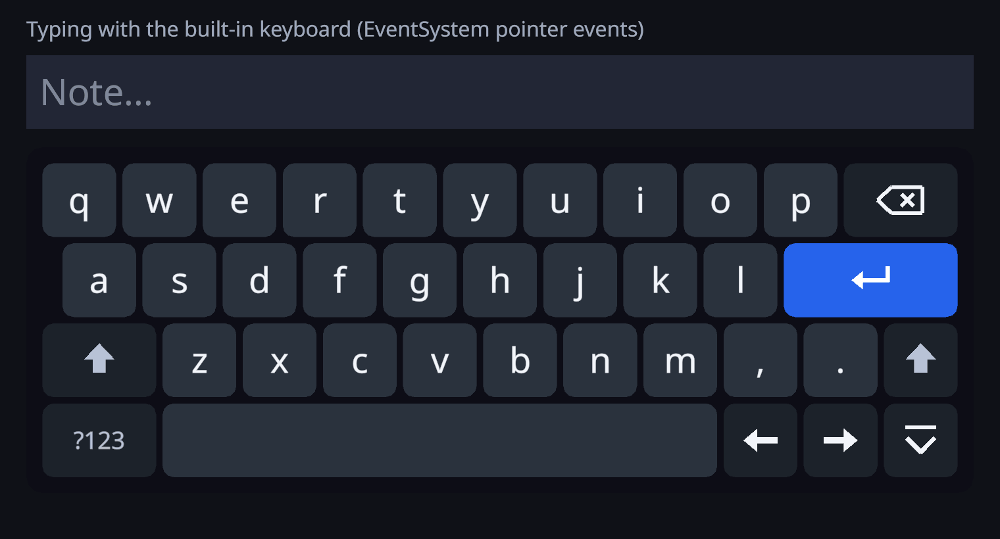

# Built-in keyboard (UniTextKeyboard): an on-screen keyboard for VR

`UniTextKeyboard` is an on-screen keyboard drawn with OpenGlyph text. It types into the focused
[`UniTextInputField`](InputField.md). It exists for XR: on Meta Quest under OpenXR, Unity's
`TouchScreenKeyboard` reports itself visible but shows nothing, so a field had no way to receive text in the
headset. The keyboard works the same on a desktop or a touch screen (forced with `SoftKeyboard = BuiltIn`).






## Quick start

**Nothing to set up in XR.** A field has `SoftKeyboard = Auto` by default. When an XR device is active and
the field gets focus, the field:

1. Finds an enabled keyboard that suits it: world space for a world field, the same Canvas for a Canvas
   field.
2. If there is none, creates one, with the field's fonts.
3. Shows it below the field.

The keyboard hides when editing ends.

To configure it, create it yourself (or use **GameObject > 3D Object > OpenGlyph > UniText Keyboard
(World)** / **GameObject > UI > OpenGlyph > UniText - Keyboard**):

```csharp
var keyboard = UniTextKeyboard.Create(null, world: true, fonts);   // 1-unit key = 4.5 cm; hidden
keyboard.Layouts.Add(UniTextKeyboardLayout.Qwerty);
keyboard.Layouts.Add(UniTextKeyboardLayout.HindiInScript);
keyboard.Layouts.Add(UniTextKeyboardLayout.Arabic);                 // the globe key cycles; space shows the name
keyboard.Rebuild();
keyboard.Placement = KeyboardPlacement.BelowField;                  // default
keyboard.onKeyPressed.AddListener(key => audioSource.PlayOneShot(click));

field.BuiltInKeyboard = keyboard;                                   // optional: this field uses this keyboard
field.SoftKeyboard = InputFieldSoftKeyboard.BuiltIn;                // optional: also without XR
```

`Show(field)` focuses a field and shows the keyboard for it. `Show()` and `Hide()` work without a field.

## How it types

The keyboard uses the field's own input seam, so it duplicates no editing logic:

| Key | Calls |
|---|---|
| Letter / symbol / any text key | `field.ProcessText(text)`: validated, limited, undoable, masked in passwords |
| Space | `ProcessText(" ")` |
| Backspace | `ProcessKey(Backspace)`; repeats while held after `InputFieldKeyboardSources.RepeatDelay` (0.5 s) at `RepeatRate` (30/s) |
| Enter | `ProcessKey(Enter)`: a newline in `MultiLineNewline` fields, otherwise submit (which ends editing and hides the keyboard) |
| ← → | `ProcessKey(Left/Right)`: the field's grapheme- and BiDi-aware visual caret movement |
| Shift | Tap: the next key is a capital. Double-tap within `CapsLockDoubleTap` (0.35 s): caps lock. Labels change case. |
| `?123` / `ABC` | Switch page (letters / numbers & symbols) |
| 🌐 (layout) | Next entry of `Layouts`. The key is left out (the space bar is wider) when there is only one layout. |
| Hide | Hide the keyboard and end editing |

A field opens the keyboard through its `IInputFieldTouchKeyboard` seam (`UniTextKeyboardTouchAdapter`), the
same seam the system keyboard uses. Unlike a system keyboard, it keeps no copy of the text, so nothing is
synced back and nothing allocates per frame.

**Focus.** On a press, an input module deselects the current selection. The keyboard implements
`IInputFieldFocusKeeper`, so a press on a key keeps the field focused, and the field selects itself again in
`LateUpdate`. A press anywhere else ends editing as before.

**Which layout.** It depends on the field's `KeyboardType`, which the content type sets:

| Field | Layout |
|---|---|
| IntegerNumber, DecimalNumber, Pin (NumberPad / DecimalPad / PhonePad) | `NumericLayout` (default `UniTextKeyboardLayout.Numeric`: 1–9, 0, `-`, `.`, Backspace, Enter, ← →, Hide) |
| EmailAddress | `EmailLayout` (default `UniTextKeyboardLayout.Email`: QWERTY with `@ . .com _` on the bottom row) |
| anything else | `TextLayout`: the current entry of `Layouts` (default `UniTextKeyboardLayout.Qwerty`) |

The field still validates what is typed: a `-` in the middle of an integer is rejected, as from a physical
keyboard.

**Passwords.** In a Password or PIN field (`IsSecure`), keys work the same, but no key preview popup is
shown.

## Interaction

Each key is a label with a `UniTextKeyboardKey` component that implements `IPointerDownHandler`,
`IPointerUpHandler`, `IPointerEnterHandler` and `IPointerExitHandler`:

| Mode | Labels | Pointers |
|---|---|---|
| World (`IsWorld`) | `UniTextWorld`, `Collider = Always` while shown (one BoxCollider per key, the [world text](WorldText.md) collider option) | `PhysicsRaycaster`, XRI `TrackedDevicePhysicsRaycaster` (ray and poke interactors through `XRUIInputModule`) |
| Canvas | `UniText` (raycast target) | `GraphicRaycaster`, XRI `TrackedDeviceGraphicRaycaster` on a World Space canvas, mouse, touch |

For custom interaction code (hand tracking without the EventSystem, a poke volume):

- `GetKeyAt(worldPoint)` returns the key under a point.
- `PressKey(key)` / `ReleaseKey(key)` / `TapKey(key)` press keys.
- `FindKey("a")` / `FindKey("Backspace")` find a key by label, text or action.

**Feedback.** Hover and press recolour the key's vertices (`HoverColor`, `PressedColor`). A pressed key
shrinks to 94 %. Nothing is rebuilt and no material is copied. `onKeyPressed(string)` (the typed text or the
action name) and the C# event `KeyPressed(key, pointerEvent)` fire on every press and Backspace repeat. Use
them for click sounds and haptics: the pointer event identifies the interactor.

## Placement

| `Placement` | Where |
|---|---|
| `BelowField` (default) | The top edge sits `FieldGap` (2 cm) below the field's bottom edge and `TowardViewer` (4 cm) in front of it. The keyboard is tilted by `Tilt` (20°), bottom towards the viewer. On a Screen Space canvas it goes below the field on the same canvas, untilted. The keyboard a field creates on demand there is docked at the bottom of the canvas instead (`Manual`). |
| `Transform` | `Anchor`'s pose plus `AnchorOffset` (anchor-local). Use it for a wrist or a fixed console. |
| `FollowHead` | `FollowDistance` (0.45 m) in front of the head (`Head`, else `Camera.main`) and `FollowHeight` (−0.28 m) below it, yaw only. Lazy: it starts moving when the keyboard leaves the `FollowAngle` (30°) cone, eases at `FollowSpeed`, and stops when it arrives. |
| `Manual` | Never moved. |

`Place(field)` re-applies the placement, for example after moving the field. `SetPhysicalKeySize(metres)`
scales a world keyboard so a 1-unit key has that width.

## Layouts

A layout (`UniTextKeyboardLayout`, a ScriptableObject) is data:

- `displayName` is shown on the space bar when there are several layouts.
- `language` is the BCP 47 tag used to shape the key labels.
- Pages of rows of keys. Each key has an `action` (Text, Backspace, Enter, Space, Shift, Left, Right, Hide,
  Page, NextLayout, Tab), `text` / `shiftText` (any Unicode string, also several code points such as
  `क्ष` or `.com`), an optional `label` / `shiftLabel`, a `width` in key units, and a `page` for Page keys.

Create one from **Assets > Create > OpenGlyph > Keyboard Layout**, or from JSON:

```csharp
var german = UniTextKeyboardLayout.FromJson(File.ReadAllText(path));
keyboard.Layouts.Add(german);
keyboard.Rebuild();
string json = UniTextKeyboardLayout.Qwerty.ToJson();   // a starting point
```

```json
{ "displayName": "Deutsch", "language": "de",
  "pages": [ { "name": "letters", "rows": [
    { "indent": 0,   "keys": [ { "action": 0, "text": "ä" }, { "action": 0, "text": "ß", "shiftText": "ẞ" }, { "action": 1, "width": 1.5 } ] },
    { "indent": 0.5, "keys": [ { "action": 4 }, { "action": 0, "text": "ö" }, { "action": 3, "width": 2 } ] } ] } ] }
```

Built-in layouts:

| Layout | Content |
|---|---|
| `Qwerty` | English letters, Shift / caps lock, `, .` (Shift: `! ?`). Page 2: digits and `@#$%&-+()*"':;!?/,.` |
| `Email` | `Qwerty` with `@`, `.`, `.com` and `_` on the bottom row |
| `Numeric` | Phone-style pad: `1 2 3 / 4 5 6 / 7 8 9 / - 0 .`, Backspace, Enter, ← →, Hide |
| `HindiInScript` | Hindi (Devanagari) "InScript-lite": the InScript key positions on three rows: consonants, vowel signs (matras), virama `्`, anusvara `ं`, and `, .`. Shift gives the independent vowels (अ आ इ ई उ ऊ ए ऐ ओ औ ऋ), the aspirates and `।`. Page 2 has Devanagari digits (Shift: ASCII digits). Conjuncts are typed as consonant + virama + consonant, so क ् ष gives क्ष. |
| `Arabic` | The Arabic PC layout letters (ض ص ث ق ف غ ع ه خ ح ج / ش س ي ب ل ا ت ن م ك ط / ذ ئ ء ؤ ر ى ة و ز ظ د), `،` (Shift: `؟`). Page 2 has Arabic-Indic digits. |

The labels are OpenGlyph text, so complex scripts shape correctly (a vowel-sign key shows its matra on a
dotted circle), as long as the keyboard's `FontStack` covers the script. An auto-created keyboard uses the
field's font stack.

## Look and size

The sizes are in the keyboard's local units: `KeySize` (100), `KeyGap`, `Padding`, `CornerRadius` and
`LabelScale`. The colours are `PanelColor`, `KeyColor`, `SpecialKeyColor` (modifier keys), `AccentKeyColor`
(Enter), `HoverColor`, `PressedColor`, `LabelColor` and `SpecialLabelColor`. The defaults are a dark theme.
The icons (Shift with a caps-lock bar, Backspace, Enter, arrows, Hide, globe) are vector shapes in the
background mesh, so they need no icon font or sprite.

## Cost

| | |
|---|---|
| Objects | One label per key. A world key is a `UniTextWorld` MeshRenderer, a Canvas key a `UniText`. There is one background mesh (panel, key caps, icons) and one preview popup (hidden). |
| Materials | All world labels share one `UniText/World/Uber` material, as all world text does. The background uses the shared unlit vertex-colour material of the input field overlays. No material is copied. |
| Draw calls | The full QWERTY letters page has 37 keys, which is 30 renderers with geometry (29 labels + 1 background), with 2 materials. In Play Mode (Built-in pipeline, Editor, dynamic batching) a frame with the keyboard costs **6 draw calls against 2 for the empty frame (+4)** (`Wave5KeyboardPlayTests`). On URP the SRP Batcher batches the shared-material renderers instead. Measure on device for your pipeline. |
| Per frame | 0 B managed allocation while shown and idle (`Wave5KeyboardTests.IdleVisibleKeyboard_AllocatesNothingPerFrame_AndDrawsWithSharedMaterials`, 600 frames). Hover and press upload vertex colours only. |
| Show / hide | Toggles renderers and colliders (world), or CanvasRenderer culling and the CanvasGroup (Canvas). Nothing is rebuilt. |
| Layout switch | Re-labels the pooled keys. Labels whose text did not change are not rebuilt. |

## Limitations

- **Hindi layout.** It is a reduced InScript ("lite"), not the full layout: the nukta forms, ज्ञ / त्र /
  क्ष / श्र shortcuts, ॅ / ॉ and Vedic signs are missing. Add them in your own layout.
- **Typing aids.** There is no word prediction, autocorrect, long-press accents or swipe typing.
- **IME.** There is no IME (Chinese / Japanese / Korean composition). Hangul and kana layouts would need
  composition logic and are not included.
- **Screen Space fields.** For a field on a Screen Space canvas the auto-created keyboard docks at the
  bottom of that canvas. In VR, use a World Space canvas or world fields.
- **Device checks.** Ray and poke interaction, comfort placement and draw cost were verified in the
  Editor only. Verify them on device.

## Tests

| File | What it checks |
|---|---|
| `Tests/Editor/Wave5KeyboardTests.cs` | Keys typed through EventSystem pointer events reach the focused field (text, space, arrows, Backspace, `onKeyPressed`, undo); Shift once / caps lock / slow taps; symbol page; layout key hidden with one layout and cycling Hindi / Arabic / QWERTY, kept for the next field; Backspace repeat on a manual clock (delay, rate, release); Enter submits a single-line field and inserts a newline in a multi-line one; Hide; numeric pad for Integer / Decimal / PIN with the field's validation, e-mail row; `SoftKeyboard` Auto picks BuiltIn in XR, System on a phone, None on desktop, and the forced modes; a keyboard created on demand for a world field; a key press keeps the field selected, a press elsewhere ends editing; world keys hit by a `PhysicsRaycaster` at an angle type "valve"; key preview, none for passwords; Devanagari and Arabic code points and shaping (no missing glyphs, conjunct, RTL order); a JSON layout and a JSON round trip of QWERTY; placement below the field and lazy head follow; 0 GC per idle frame; one label material and one background mesh. |
| `Tests/Runtime/Wave5KeyboardPlayTests.cs` | Play Mode draw calls / batches / SetPass of the full QWERTY page against an empty frame. |
