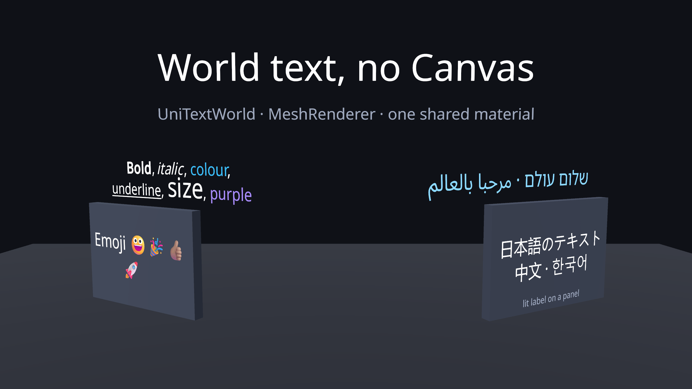
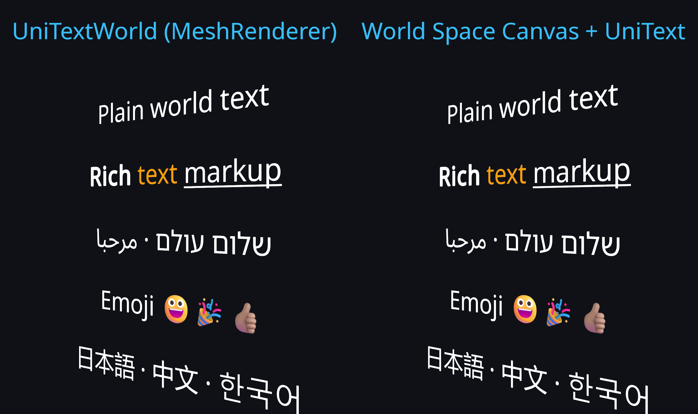
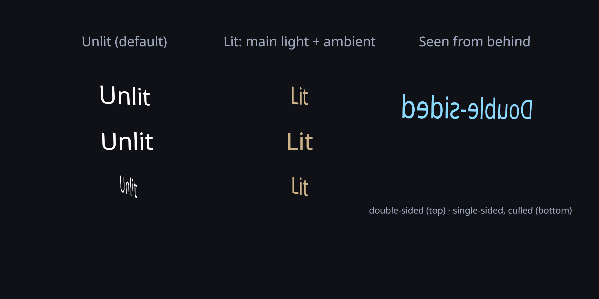
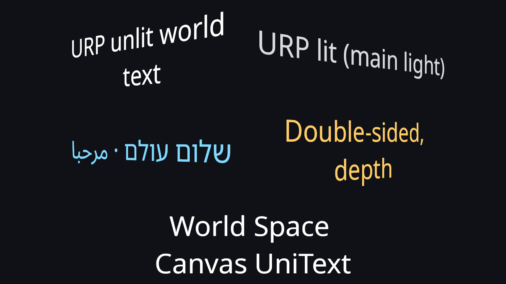

# World-space text (UniTextWorld, GlyphMeshPro)

`UniTextWorld` draws UniText through a `MeshRenderer`, without a Canvas. `OpenGlyph.GlyphMeshPro` is the
same thing with the TextMesh Pro API (the counterpart of TMP's `TextMeshPro`, as `GlyphMeshProUGUI` is the
counterpart of `TextMeshProUGUI`).



## What it does

- **Same engine as UniText.** Markup, HarfBuzz shaping, BiDi, font fallback (including system CJK faces),
  colour emoji, overflow modes, Auto Size, padding, OpenType features, language, span styles, gradients,
  span animations and `UniTextReveal`. Only the last step differs: the draw-group meshes are copied into
  one mesh owned by the component (one sub-mesh per draw group) instead of CanvasRenderers.
- **Identical output.** For the same text, font, size and rect the glyph ids, clusters, positions and
  vertices are the same as a UniText on a World Space Canvas, and a camera render at an angle is
  pixel-identical (`Wave3WorldTextTests.World_ShapingAndGeometry_IdenticalToCanvasUniText`,
  `Wave3WorldRenderTests.Render_WorldUnlit_MatchesWorldSpaceCanvas_AtAnAngle`: 0 differing pixels).
- **One material for many labels.** With the unified renderer every label with the same render options
  uses the same `UniText/World/Uber` material (per atlas format). Per-glyph data (atlas page, glyph mode,
  style row) is vertex data, so there is no per-renderer material state and no `MaterialPropertyBlock`:
  one draw per label, SRP-Batcher compatible.
- **No Canvas cost.** No Canvas, no canvas batch rebuild, no `GraphicRaycaster`. Each label is one
  `MeshRenderer` with correct bounds for frustum culling (bounds follow animated glyphs).



## Usage

**GameObject > 3D Object > OpenGlyph > UniText World** creates a 200 x 50 label at scale 0.01 (2 m x 0.5 m).
From code:

```csharp
var go = new GameObject("Label", typeof(RectTransform));
go.transform.SetPositionAndRotation(new Vector3(0, 1.6f, 2f), Quaternion.identity);
go.transform.localScale = Vector3.one * 0.005f;          // 200 local units = 1 m
var label = go.AddComponent<UniTextWorld>();             // adds MeshFilter + MeshRenderer
label.RegisterDefaultMarkup();                            // <b>, <color>, ... (a plain component parses no tags)
label.rectTransform.sizeDelta = new Vector2(400, 80);     // text area, local units
label.FontSize = 36;                                      // 36 local units = 18 cm per em here
label.Text = "Valve <b>A</b> · <color=#38BDF8>open</color>";
label.Lighting = WorldTextLighting.Lit;                   // optional
label.SortingOrder = 2;                                   // MeshRenderer sorting
```

TextMesh Pro API:

```csharp
var tmp = go.AddComponent<OpenGlyph.GlyphMeshPro>();      // instead of TMPro.TextMeshPro
tmp.text = "Hello";
tmp.fontSize = 36;
tmp.alignment = TextAlignmentOptions.Center;
tmp.sortingOrder = 5;
```

**Units.** The `RectTransform` rect, `FontSize` and every other length are in the object's local units,
exactly as for a UniText on a Canvas; scale the transform to size the text in the world.
`UniTextWorld.WorldSize` reads and writes the rect size in world units. (Font sizes below 1 are clamped,
so do not use a 1:1 metre scale with tiny font sizes.) TMP's `TextMeshPro` applies a fixed 0.1 glyph scale
(font size 36 in a 20 x 5 rect); the GlyphMeshPro equivalent is localScale 0.1 with a 200 x 50 rect, which
the **GlyphMeshPro - Text** menu item creates.

## Properties

| Property | Default | Notes |
|---|---|---|
| `Lighting` | `Unlit` | `Lit`: wrapped-Lambert main directional light + `unity_AmbientSky`. URP main light or Built-in `ForwardBase` light. |
| `DepthWrite` | off | Writes depth with an alpha clip at 0.5 coverage, AlphaTest queue (2450). Off: transparent queue, no depth write. |
| `DoubleSided` | off | `Cull Off`. Off: back faces are culled (text is visible from its front, the -Z side). |
| `Collider` | `WhenInteractive` | `None` / `WhenInteractive` (links or pointer-event subscribers) / `Always`: a BoxCollider sized to the rect, for pointer events. |
| `SortingLayerID`, `SortingOrder` | 0 | Forwarded to the MeshRenderer (GlyphMeshPro: `sortingLayerID`, `sortingOrder`). |
| `WorldSize` | | Rect size in world units (rect x lossy scale). |
| `Options` | | All of the above as one `WorldTextOptions` value. |
| `WorldMesh`, `WorldRenderer` | | The component's mesh and renderer (GlyphMeshPro: `mesh`, `renderer`). |

Every UniText property applies (`Text`, `FontStack`, `FontSize`, `AutoSize`, `Overflow`, alignment,
`Padding`, `Style`, `GradientFill`, modifiers, …). The inspector is the UniText (or GlyphMeshPro) inspector
plus a **World Rendering** section; the rect is drawn as a gizmo in the Scene view.



## Shaders

`UniText/World/Uber` is the Uber SDF/MSDF/bitmap/emoji program of the Canvas shader (both include
`Shaders/UniText_UberCore.cginc`) with a world pass in `Shaders/UniText_UberWorld.cginc`:

- SubShader 1 is tagged `RenderPipeline = UniversalPipeline` (`LightMode = UniversalForward`); SubShader 2
  is the Built-in pipeline (`ForwardBase`). No render-pipeline include is used, so the shader compiles in
  projects with and without URP.
- Single-pass instanced / multiview stereo macros, `multi_compile_instancing`, `multi_compile_fog`.
- `shader_feature_local` keywords `_UNITEXT_LIT` and `_UNITEXT_ALPHACLIP`; `_Cull`, `_ZWrite`, `_ZTest`
  material state; `_LightWrap` (0 = Lambert, 1 = half-Lambert) and `_AlphaClipThreshold`.
- Vertex colours are converted to linear in a Linear project, as a Canvas does before its UI shaders.
- The build processor adds it to Always-Included Shaders (the materials are created at run time).

Checked in a URP 17.3 project (Unity 6000.3, D3D12): the shader compiles with no messages, it reports
SRP-Batcher compatible, and unlit, lit, double-sided and RTL world labels render next to a World Space
Canvas reference. Not yet checked on a Quest headset.



## Pointer events (links, clicks) in world space

`TextClicked`, `RangeClicked`, `RangeEntered` / `RangeExited` and link modifiers work as on a Canvas,
through standard EventSystem interfaces (`IPointerClickHandler`, enter / exit / move):

- Add a `PhysicsRaycaster` to the camera (or use XR Interaction Toolkit's `TrackedDevicePhysicsRaycaster`
  with `XRUIInputModule`). Interactive world text keeps a BoxCollider sized to its rect (not saved into
  the scene). The hit glyph comes from the raycast's 3D hit point, so tracked-device rays work without a
  meaningful screen position; without it, a ray from the event camera through the pointer position is
  intersected with the text plane.
- Custom pointers: `HitTestRay(ray)`, `HitTestWorld(point)` return the glyph / cluster;
  `ClickAtWorldPoint(point)` raises the click events.
- XRI's `TrackedDeviceGraphicRaycaster` only sees Canvas graphics; world text uses the physics path. XRI
  is not referenced by the package and was not installed in the test project, so the XRI path is by design
  (same EventSystem interfaces, raycast result with `worldPosition`), not tested.

```csharp
label.RangeClicked += hit => Debug.Log("link " + hit.range.data);
camera.gameObject.AddComponent<UnityEngine.EventSystems.PhysicsRaycaster>();
// or, from an XR controller without the EventSystem:
var hit = label.HitTestRay(new Ray(controller.position, controller.forward));
```

## Cost

Play Mode in the Editor (Windows, D3D12, Built-in pipeline, unified renderer, one font), labels
"Label i" rebuilt to "Value i", one camera rendering into a 1280 x 720 target
(`Tests/Runtime/Wave3WorldLabelsPlayTests.cs`, one run):

| Scenario | N | Create + first build | Rebuild all texts | Frame draw calls / batches |
|---|---|---|---|---|
| UniTextWorld | 100 | 24.8 ms | 2.2 ms | 4 / 4 |
| One World Space Canvas per label | 100 | 28.0 ms | 2.8 ms | 202 / 202 |
| One shared World Space Canvas | 100 | 14.9 ms | 2.4 ms | 4 / 4 |
| UniTextWorld | 500 | 51.5 ms | 9.8 ms | 4 / 4 |
| One World Space Canvas per label | 500 | 98.6 ms | 12.2 ms | 1002 / 1002 |
| One shared World Space Canvas | 500 | 82.4 ms | 11.3 ms | 4 / 4 |

The frame counters are for the whole frame (the empty frame is about 4). The Built-in pipeline
dynamic-batches the small world-label meshes because they share one material; under URP the SRP Batcher
batches them instead (one draw per label, no per-draw state change). A Canvas per label costs one batch
per Canvas (2 per label here). A single shared Canvas is cheap to draw but rebuilds as one batch whenever
any label changes, and all labels must live under it. EditMode timings (`Wave3WorldPerfTests`, three runs)
agree: world labels 16 to 27 ms (N = 100) and 89 to 135 ms (N = 500) to create and build, against 30 to
37 ms and 140 to 144 ms for one Canvas per label; rebuilds are within 10 % of each other. Not yet measured
on a Quest.

## Limitations

- The default hover/click highlighter draws UI Graphics, which need a Canvas: world text has no highlight
  graphics (world components drop the default `DefaultTextHighlighter` in `Awake`). Use the range events.
- `Mask` / `RectMask2D` do not apply (no Canvas). `Overflow = Clip` works with the unified renderer: a
  per-renderer `_ClipRect` in object space (that one renderer leaves the SRP Batcher). The legacy renderer
  does not clip in world space.
- Legacy renderer: draws with the font materials (the Canvas SDF/MSDF shaders) and one property block per
  page; works, but has no lighting / depth / culling options and is not SRP-Batcher friendly. Use the
  unified renderer (the default) for world text.
- Lighting is the main directional light and the flat ambient sky colour only: no additional lights,
  shadows or light probes. No depth-only or shadow-caster pass.
- Not instanced across labels (each label has its own mesh); batching comes from the shared material.

## Tests

`Tests/Editor/Wave3WorldTextTests.cs`, `Wave3WorldRenderTests.cs`, `Wave3WorldPerfTests.cs`,
`Tests/Runtime/Wave3WorldLabelsPlayTests.cs`.
