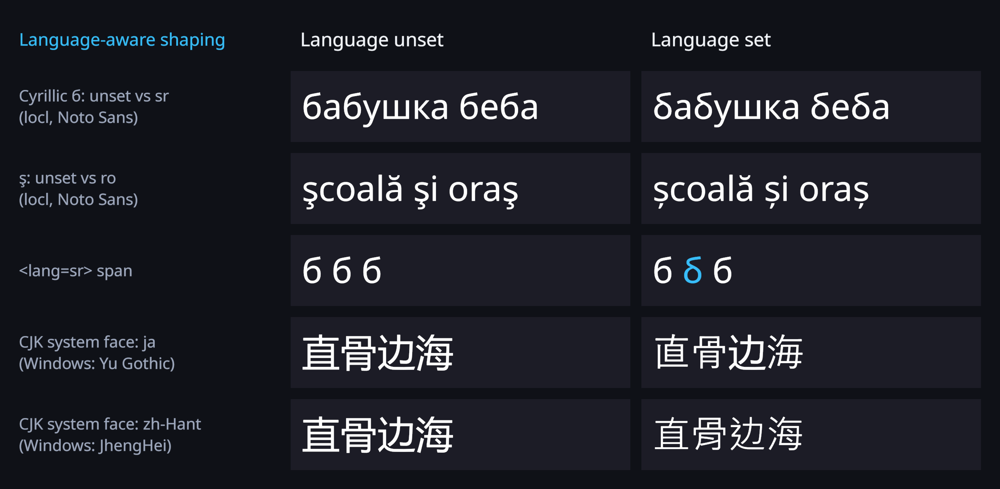
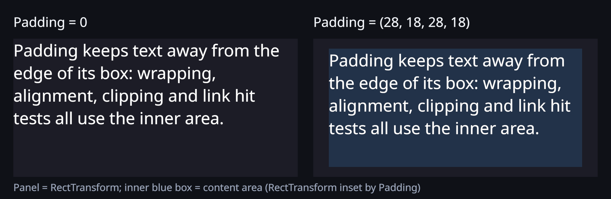
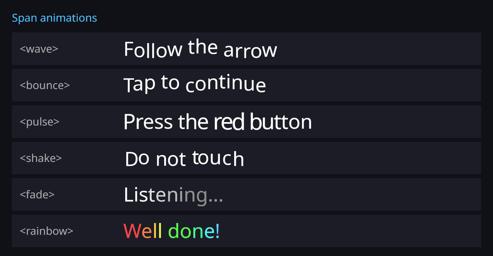
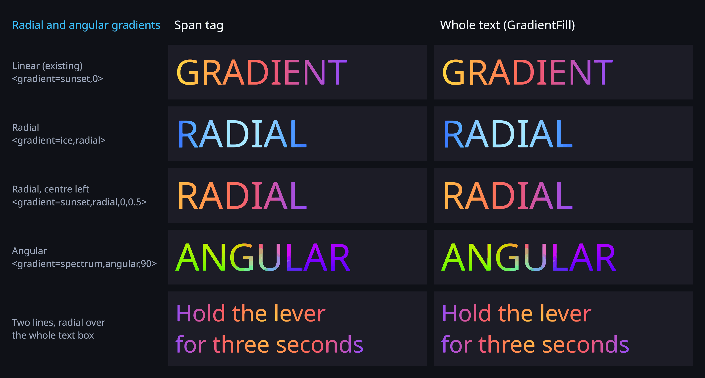

<div align="center">


# OpenGlyph

**HarfBuzz-shaped Unicode text for Unity — UI, world space and VR**

[](LICENSE.md)
[](package.json)
[](Conformance~/README.md)
[](#unicode-conformance)


[▶ Full-quality video (MP4)](.github/assets/intro/openglyph_intro.mp4)

</div>


OpenGlyph is an open-source (MIT) text engine for Unity, forked from UniText 1.0. Text is shaped by
[HarfBuzz](https://harfbuzz.github.io/), laid out with Unicode-conformant BiDi and line breaking,
and rendered as SDF/MSDF through Unity's Canvas — including in VR.

## Key features

| | Feature | Details |
|---|---|---|
| 🌐 | **Every script via HarfBuzz** | Arabic, Hebrew, Devanagari and other complex scripts are shaped by HarfBuzz. Thai, Lao, Khmer and Myanmar get dictionary word breaking (ICU-matched). Any script your font stack does not cover (CJK, Tamil, Bengali, Georgian, Ethiopic, Tibetan, ...) falls back to an installed system font at runtime, with one warning per script; bundle fonts for consistent results across devices ([details](Documentation/SystemFontFallback.md)). |
| 🔄 | **Full UAX #9 BiDi** | Mixed LTR/RTL text with numbers and punctuation; 100 % of the Unicode 17.0 BiDi conformance data (861,948 cases). |
| 😀 | **Color emoji** | COLRv1 color glyphs; ZWJ sequences (e.g. 👨‍👩‍👧‍👦) are a single grapheme cluster. |
| 🏷️ | **Rich text & span styles** | `<b> <i> <u> <s> <color> <size> <gradient> <link> <cspace> <sup> <sub>` and more; per-span outline/underlay styles. |
| ✂️ | **Overflow modes** | Overflow, Truncate, Ellipsis (grapheme- and RTL-aware) and Clip; works with Mask and RectMask2D. |
| 🧱 | **Unified renderer + legacy** | Default unified path: one Uber shader with a shared atlas array — SDF text is one draw group per component, never more than two when MSDF/emoji are mixed. The legacy per-material path remains selectable. |
| 🥽 | **VR-ready** | All shaders declare single-pass-instanced stereo macros; verified on a Meta Quest 3S (OpenXR, Vulkan) in both eyes. |
| 🔁 | **GlyphMeshProUGUI** | A TextMesh Pro–style API on top of the OpenGlyph engine ([below](#drop-in-textmesh-pro-api--glyphmeshprougui)). |
| 🔍 | **MSDF** | Multi-channel SDF glyphs for sharp corners at large sizes. |
| 👾 | **Pixel fonts** | Pixel-grid detection and pixel-perfect rendering at integer scales. |
| ⚡ | **Parallel processing** | Shaping and layout run across worker threads, byte-identical to the serial path. |
| 🗜️ | **Font compression** | Font bytes stored compressed (Deflate by default) and decompressed transparently; byte-exact round trip. |
| 🔣 | **OpenType features** | Any feature the font has (`tnum`, `onum`, `smcp`, `ss01`, `cv01`, `liga=0`, …) for the whole text (`FontFeatures`) or a span (`<feature=…>`) ([below](#opentype-features)). |
| 🗣️ | **Language-aware shaping** | BCP 47 `Language` and `<lang=…>`: language-specific glyph forms (`locl`) and the right CJK system face for ja / ko / zh-Hans / zh-Hant / zh-HK ([below](#language-aware-shaping)). |
| 📐 | **Content measurement, padding, fit steps** | `GetMinContentWidth()`, `GetMaxContentWidth()`, `GetHeightForWidth(w)`; box-model `Padding`; Auto Size `AutoSizeStep` for discrete sizes ([below](#layout-padding-measurement-and-auto-size-steps)). |
| 🌍 | **Unity Localization** | Optional `LocalizeUniText` sets the text and its language on locale change; compiles only when `com.unity.localization` is installed ([below](#unity-localization)). |
| ⌨️ | **Reveal / typewriter** | `UniTextReveal`: by grapheme, word or line, speed, delay, fade, slide, easing, events, `<pause=s>`; logical (RTL-correct) order; no re-layout per frame ([below](#reveal-and-text-animations)). |
| 🌊 | **Text animations** | `<wave> <bounce> <pulse> <shake> <fade> <rainbow>` span tags on a shared clock; a per-frame vertex pass with 0 GC per frame ([below](#reveal-and-text-animations)). |
| ✨ | **Glow, inner shadow, second outline** | SDF glow (colour, size, softness, intensity), inner shadow and a second stroke band, per span and for the whole text ([below](#glow-inner-shadow-second-outline)). |
| 🎨 | **Radial and angular gradients** | `<gradient=name,radial>`, `<gradient=name,angular,deg>` and a whole-text `GradientFill`; both renderers ([below](#radial-and-angular-gradients)). |

## Drop-in TextMesh Pro API — GlyphMeshProUGUI


`OpenGlyph.GlyphMeshProUGUI` is a Canvas text component whose members are named after
TextMesh Pro's, so existing TMP code usually migrates by changing the `using` and the type name:

```diff
- using TMPro;
+ using OpenGlyph;

- var label = gameObject.AddComponent<TextMeshProUGUI>();
+ var label = gameObject.AddComponent<GlyphMeshProUGUI>();
  label.text = "<b>Hello</b> world";
  label.fontSize = 48;
  label.fontStyle = FontStyles.Italic | FontStyles.Underline;
  label.alignment = TextAlignmentOptions.Center;
  label.color = Color.white;
  label.overflowMode = TextOverflowModes.Ellipsis;
```

Create one from **GameObject > UI > OpenGlyph > GlyphMeshPro - Text**.

**Implemented and applied by the engine** (verified in `Runtime/GlyphMeshPro/GlyphMeshProUGUI*.cs`):

- `text`, `SetText(string)`, `SetText(StringBuilder)`, `SetText(string, float…)` with `{0}`–`{7}` placeholders
- `font` (a `UniTextFont`), `fontSize`, `enableAutoSizing`, `fontSizeMin`, `fontSizeMax`, `fontWeight`
- `fontStyle`: Bold, Italic, Underline, Strikethrough, UpperCase, LowerCase, SmallCaps (OpenType `smcp` or synthetic), Superscript, Subscript, Highlight
- `color` (inherited from `Graphic`), `enableVertexGradient`/`colorGradient`, `alignment` (incl. Justified and Flush), `textWrappingMode`, `enableWordWrapping`
- `characterSpacing`, `wordSpacing`, `lineSpacing`, `paragraphSpacing` (TMP units: em/100), `margin`, `richText`
- `maxVisibleCharacters`/`Words`/`Lines` (mesh-only update, so typewriter effects do not reshape or re-layout)
- `overflowMode`: Overflow, Ellipsis, Truncate, Masking, ScrollRect, Page (`pageToDisplay`), Linked (`linkedTextComponent`)
- `isRightToLeftText`, `preferredWidth`/`preferredHeight`, `GetPreferredValues(…)`, `GetRenderedValues()`, `ForceMeshUpdate()`, `textInfo` (character/line/word/page subset)
- Rich-text tags registered automatically: `<b> <i> <u> <s> <color> <size> <cspace> <line-height> <link> <uppercase> <lowercase> <smallcaps> <sup> <sub> <voffset> <mark> <nobr> <noparse> <align> <indent> <line-indent> <font>`

**Not full parity.** Not yet supported: `<sprite>` and other tags listed in the parity doc
(`<mspace> <space> <width> <alpha>`, inline `<margin>`), `TMP_ColorGradient` presets, the
PreserveWhitespace wrapping modes, and the world-space `GlyphMeshPro` (MeshRenderer) component, which is a stub.
TMP font assets are not used — fonts are `UniTextFont` assets. Full mapping:
[GlyphMeshPro-Parity.md](Documentation/GlyphMeshPro-Parity.md).


The typewriter only rebuilds the mesh: changing `maxVisibleCharacters` never reshapes or re-lays out the text.

## Typography and layout

### OpenType features

```csharp
price.FontFeatures = new[] { "tnum" };   // tabular figures for the whole text
label.RegisterModifier(new ModRegister { Rule = new FeatureParseRule(), Modifier = new FeatureModifier() });
label.Text = "Total <feature=tnum>1,234.50</feature>, <feature=smcp>small caps</feature>, <feature=liga=0>fish</feature>";
```

Settings are HarfBuzz-style (`tnum`, `-kern`, `liga=0`, `aalt=2`); a span applies to exactly its
characters and overrides the component list. [OpenTypeFeatures.md](Documentation/OpenTypeFeatures.md)


### Language-aware shaping

```csharp
title.Language = "sr";        // Serbian б; "ro" gives ș for ş; "ja", "zh-Hant" pick the CJK forms and face
label.RegisterModifier(new ModRegister { Rule = new LanguageParseRule(), Modifier = new LanguageModifier() });
label.Text = "直 <lang=ja>直</lang> <lang=zh-Hant>直</lang>";
```

The language goes to HarfBuzz (`hb_buffer_set_language`) and picks the CJK system font face per
component and per span when the font stack does not cover a character. Unset keeps the previous
behaviour. [LanguageShaping.md](Documentation/LanguageShaping.md)



### Layout: padding, measurement and Auto Size steps

```csharp
card.Padding = new Vector4(24, 12, 24, 12);  // left, top, right, bottom: layout, preferred size, Clip, hit tests
float narrowest = card.GetMinContentWidth(); // widest unbreakable word
float widest    = card.GetMaxContentWidth(); // widest hard line
float height    = card.GetHeightForWidth(320f);
label.AutoSize = true;
label.AutoSizeStep = 1f;                     // 26 pt instead of 26.8125 pt
```

The measurements never change the component's rect or layout. [Padding.md](Documentation/Padding.md) ·
[ContentMeasurement.md](Documentation/ContentMeasurement.md) · [AutoSizeSteps.md](Documentation/AutoSizeSteps.md)




### Unity Localization

With `com.unity.localization` installed, add **OpenGlyph > Localize UniText** next to a UniText: the
`LocalizedString` drives `Text`, and the selected locale's code drives `Language`. Without the package
the `OpenGlyph.Localization` assembly is skipped. [Localization.md](Documentation/Localization.md)

## Effects and animation

### Reveal and text animations

```csharp
UniTextReveal.RegisterPauseTag(step);                   // <pause=seconds>
TextAnimationModifier.RegisterAll(step);                // <wave> <bounce> <pulse> <shake> <fade> <rainbow>
step.Text = "Open valve A.<pause=0.6> Then press the <pulse><color=#ff4040>red</color></pulse> button.";

var reveal = step.gameObject.AddComponent<UniTextReveal>();
reveal.Unit = RevealUnit.Word;                           // Character (grapheme) | Word | Line
reveal.UnitsPerSecond = 6f;
reveal.FadeDuration = 0.2f;
reveal.SlideOffset = new Vector2(0, -10);
reveal.RevealCompleted += () => nextButton.SetActive(true);
reveal.Restart();                                        // Play / Pause / Skip / Restart
```

Both are vertex effects on the mesh the text already has: once per rebuild the final mesh is captured,
then each frame only vertex positions and colours change and are uploaded. No shaping, layout or mesh
generation per frame, no managed allocation per frame, unified and legacy renderer, and components
without animated text pay nothing. Reveal units follow logical order, so right-to-left text reveals
from the right. [TextReveal.md](Documentation/TextReveal.md) · [TextAnimations.md](Documentation/TextAnimations.md)




### Glow, inner shadow, second outline

```csharp
label.Text = "<glow=#38BDF8,0.8,0.5,1.4>WARNING</glow> <glow=#000000,0.9,0.7>over a busy scene</glow> " +
             "<innershadow=#7A3500,0.35,-0.35,0,0.3>Pressure</innershadow> " +
             "<outline=#FFFFFF,0.15><outline2=#E11D48,0.25>STOP</outline2></outline>";
```

Register `SpanStyleModifier` kinds `Glow` / `InnerShadow` / `Outline2` with `GlowParseRule`,
`InnerShadowParseRule`, `Outline2ParseRule`; the same fields exist on the component `Style`. They come from
the glyph's distance field in the same pass (no extra geometry). Span styles need the unified renderer;
the legacy mobile SDF/MSDF shaders gained a `GLOW_ON` glow. [GlowAndShadows.md](Documentation/GlowAndShadows.md)


### Radial and angular gradients

```csharp
label.Text = "<gradient=ice,radial>RADIAL</gradient> <gradient=spectrum,angular,90>ANGULAR</gradient>";
title.GradientFill = UniTextGradientFill.Radial(myGradient, new Vector2(0.5f, 0.5f));   // whole text
```

Vertex colours, so both renderers; `<color>` and `<gradient>` spans override the whole-text fill.
[Gradients.md](Documentation/Gradients.md)



## Showcase

| Rich text | Layout |
|---|---|
|  |  |
| **SDF sharpness (OpenGlyph vs TextMesh Pro)** | **On device: Meta Quest 3S, both eyes** |
|  |  |

In the Quest capture the left column is TextMesh Pro with its default font (no fallback assets), so
non-Latin rows show missing-glyph boxes; the other columns are OpenGlyph (legacy, unified) and
GlyphMeshProUGUI. CJK comes from the device's system font. More captures:
[`Documentation/Design/evidence/quest/`](Documentation/Design/evidence/quest/).

## Benchmarks

**3–9× faster than TextMesh Pro on Quest 3S.**

Meta Quest 3S, VR (OpenXR, single-pass instanced, Vulkan, IL2CPP ARM64), Unity 6000.3.19f1.
Workload: 100 objects × 2,405 characters (Latin + Arabic + Hebrew + mixed), 10 iterations after
3 warm-ups; each value is the median of 3 runs on main `2c71ef6`. Times in ms, lower is better.

| Operation | OpenGlyph parallel | OpenGlyph 1-thread | TextMesh Pro | UI Toolkit* | × faster than TMP |
|---|--:|--:|--:|--:|--:|
| Object creation | 168.2 | 307.4 | 610.0 | 952.1 | 3.63× |
| Full rebuild | 142.9 | 247.6 | 447.8 | 893.7 | 3.13× |
| Layout (wrap + auto-size) | 139.5 | 147.9 | 1289.3 | 270.6 | 9.24× |
| Mesh rebuild (colour) | 111.6 | 118.7 | 534.8 | 164.0 | 4.79× |

**Memory & GC**

| Creation | OpenGlyph parallel | OpenGlyph 1-thread | TextMesh Pro | UI Toolkit* |
|---|--:|--:|--:|--:|
| GC collections during creation | 1 | 2 | 30 | 0 |
| Allocated during creation (MB) | 427 | 427 | 552 | 67 |

Where OpenGlyph is not ahead: destruction takes 31.9 ms vs TextMesh Pro's 29.5 ms (0.93×) and UI
Toolkit's 2.1 ms, and UI Toolkit allocates far less during creation (67 MB vs 427 MB).

\* The harness validates that OpenGlyph and TextMesh Pro actually did the work each iteration;
it cannot verify this for UI Toolkit, so treat those numbers with caution.
Summary and raw data: [`Documentation/Benchmarks/quest3s/`](Documentation/Benchmarks/quest3s/SUMMARY_main_2c71ef6.md)
(`ua_91a39f0_vr_run{1,2,3}.json`; `91a39f0` is the PR head with package content identical to main `2c71ef6`).

**Font compression** (byte-exact round trip; [`font_compression.csv`](Documentation/Benchmarks/quest3s/font_compression.csv)):

| Font | Original (bytes) | Deflate (bytes) | Saved |
|---|--:|--:|--:|
| NotoSans | 629,024 | 296,411 | −52.9 % (Brotli: 229,001) |
| NotoSansArabic | 194,176 | 88,621 | −54.4 % |
| NotoSansHebrew | 48,036 | 27,650 | −42.4 % |

## Unicode conformance

Unicode 17.0.0 test data, 100 % pass, 0 exclusions. Runners: [`Tests/Editor/Conformance/`](Tests/Editor/Conformance/);
data and results: [`Conformance~/`](Conformance~/README.md).

| Standard | Name | Cases | Pass |
|---|---|--:|--:|
| UAX #9 | Bidirectional Algorithm (`BidiTest` 770,241 + `BidiCharacterTest` 91,707) | 861,948 | 100 % |
| UAX #14 | Line Breaking | 19,338 | 100 % |
| UAX #24 | Script property (`Scripts.txt`) | 159,866 | 100 % |
| UAX #24 | Script_Extensions | 669 | 100 % |
| UAX #29 | Grapheme Clusters | 766 | 100 % |
| | **Total** | **1,042,587** | **100 %** |

## Comparison

| Feature | OpenGlyph | TextMesh Pro | UI Toolkit |
|---|---|---|---|
| BiDi (UAX #9) | ✅ Full support | ❌ Requires plugin | 🟡 Backend-dependent |
| Arabic / Hebrew shaping | ✅ Full support | ❌ Requires plugin | 🟡 Backend-dependent |
| Devanagari conjuncts | ✅ Full support | ❌ Not supported | 🟡 Backend-dependent |
| Thai / Lao / Khmer / Myanmar word breaking | ✅ Dictionary-based | ❌ Not supported | ❌ Not supported |
| CJK system-font fallback | ✅ Automatic | 🟡 Manual fallback assets | — Not verified |
| Color emoji | ✅ COLRv1 | 🟡 Sprite sheets | ❌ Not supported |
| Per-span styling | ✅ Full support | ✅ Full support | 🟡 Limited |
| Overflow (Truncate / Ellipsis / Clip) | ✅ Full support | ✅ Full support | ✅ Via USS |
| VR single-pass instanced | ✅ Verified on Quest 3S | ✅ Observed on Quest 3S | — Not verified |
| Parallel processing | ✅ Multi-threaded | ❌ Main thread | ❌ Main thread |
| MSDF | ✅ Full support | ❌ Not supported | ❌ Not supported |
| Steady-state allocation | 🟡 Low, not zero | 🟡 Low (GC on full rebuild) | 🟡 Very low* |

Every OpenGlyph ✅ cites a committed test in [FeatureComparison.md](Documentation/FeatureComparison.md),
along with the sources for the TextMesh Pro and UI Toolkit cells.

## Installation

1. Open **Window > Package Manager**
2. Click **+** > **Add package from git URL...**
3. Enter:
   ```
   https://github.com/Venkat-Swaraj-AutoVRse/OpenGlyph.git
   ```

The package name is `com.openglyph.text` (version 1.0.0 in `package.json`). For reproducible builds,
pin a commit (or a tag, once published): `https://github.com/Venkat-Swaraj-AutoVRse/OpenGlyph.git#<commit-sha>`.

## Quick start

**UniText** (the core component, namespace `LightSide`). Without an explicit font stack it uses the
project defaults from `UniTextSettings`.

```csharp
using LightSide;
using UnityEngine;

public class Hello : MonoBehaviour
{
    void Start()
    {
        var t = gameObject.AddComponent<UniText>();   // needs a RectTransform under a Canvas
        t.FontSize = 36;
        t.Text = "Mixed: Hello עולם World — مرحبا 123";
        t.Overflow = TextOverflow.Ellipsis;            // Overflow | Truncate | Ellipsis | Clip
        t.UnifiedRenderer = UniText.UnifiedRendererMode.UseProjectSetting; // or ForceOn / ForceOff
    }
}
```

**GlyphMeshProUGUI** (TMP-style API, namespace `OpenGlyph`):

```csharp
using OpenGlyph;
using UnityEngine;

public class HelloTmpStyle : MonoBehaviour
{
    void Start()
    {
        var t = gameObject.AddComponent<GlyphMeshProUGUI>();
        t.text = "<color=#38BDF8>Same</color> API, <b>new</b> engine";
        t.fontSize = 72;
        t.fontStyle = FontStyles.Bold;
        t.alignment = TextAlignmentOptions.Center;
    }
}
```

Parallel processing is on by default (`UniText.UseParallel`).

## Supported platforms

Native plugins shipped in [`Plugins/`](Plugins/):

| Platform | Architectures |
|---|---|
| Windows | x64, ARM64 |
| macOS | x64, Apple Silicon (universal) |
| Linux | x64, ARM64 |
| Android (incl. Meta Quest) | ARMv7, ARM64, x86, x64 |
| iOS | ARM64 (device), ARM64/x64 simulator |
| tvOS | static library |
| WebGL | static library |

Meta Quest 3S (Android ARM64, IL2CPP, Vulkan, OpenXR) is verified on device. Other platforms ship
binaries but were not tested on device for this release.

## Documentation

- [Getting Started](Documentation/GettingStarted.md)
- [Feature comparison (with test citations)](Documentation/FeatureComparison.md)
- [GlyphMeshPro ↔ TextMesh Pro parity](Documentation/GlyphMeshPro-Parity.md)
- [Unified vs legacy render path](Documentation/RenderPathComparison.md)
- [System font fallback (any script)](Documentation/SystemFontFallback.md)
- [OpenType features](Documentation/OpenTypeFeatures.md) · [Language-aware shaping](Documentation/LanguageShaping.md) · [Content measurement](Documentation/ContentMeasurement.md) · [Padding](Documentation/Padding.md) · [Auto Size fit steps](Documentation/AutoSizeSteps.md) · [Unity Localization](Documentation/Localization.md)
- [Text reveal](Documentation/TextReveal.md) · [Text animations](Documentation/TextAnimations.md) · [Glow, inner shadow, second outline](Documentation/GlowAndShadows.md) · [Radial and angular gradients](Documentation/Gradients.md)
- [Render architecture](Documentation/Design/RenderArchitecture.md) · [Memory budgets](Documentation/Design/MemoryBudgets.md) · [Font families](Documentation/Design/Phase2-FontFamilies.md)
- [Changelog](CHANGELOG.md)

## Credits & License

OpenGlyph is released under the [MIT License](LICENSE.md).

OpenGlyph is a fork of UniText 1.0 by Light Side (MIT). It is not affiliated with or endorsed by
Light Side LLC; see [NOTICE.md](NOTICE.md).

<details>
<summary><b>Third-Party Software</b></summary>
<br>

See [Third-Party Notices.txt](Third-Party%20Notices.txt) for full license texts.

| Component | License |
|---|---|
| **HarfBuzz** | Old MIT License |
| **FreeType** | FreeType License (FTL) |
| **Blend2D** | Zlib License |
| **Zstandard** | BSD-3-Clause |
| **zlib** | Zlib License |
| **libpng** | PNG Reference Library License v2 |
| **msdfgen** (algorithms ported to C#) | MIT License |
| **ICU word segmentation dictionaries** (Thai, Lao, Khmer, Myanmar) | Unicode License V3 |

Fonts (Noto Sans, Noto Sans Arabic, Noto Sans Hebrew and the test fixtures) are licensed under the
[SIL Open Font License 1.1](https://openfontlicense.org). Unicode data and conformance test files
are licensed under the [Unicode License V3](https://www.unicode.org/license.txt).

</details>
